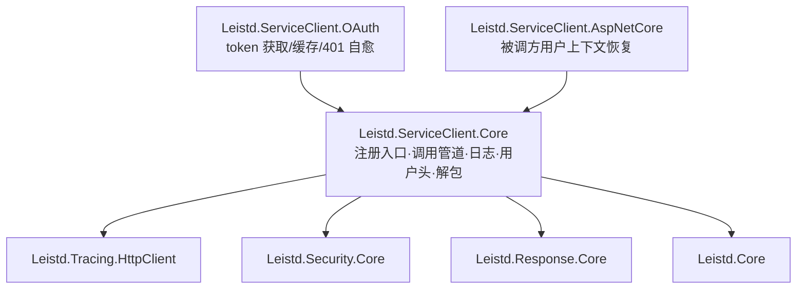
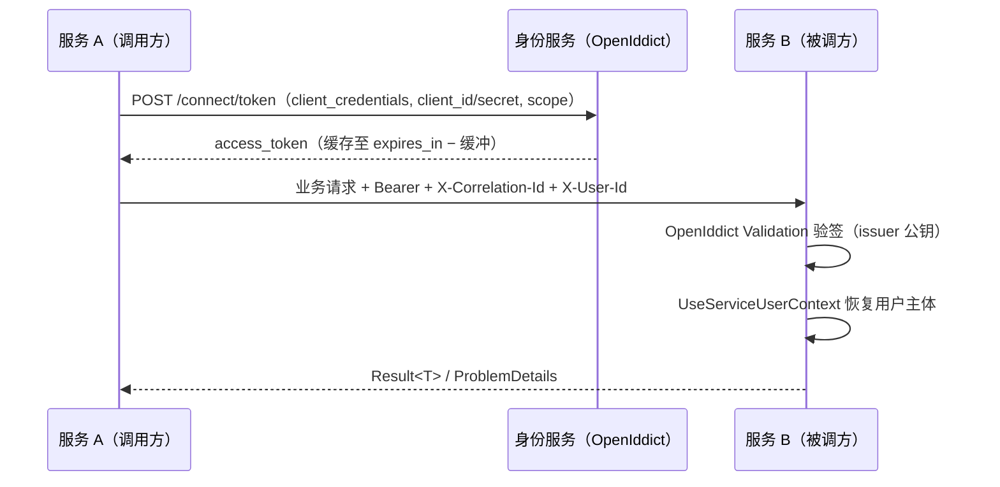

# 服务调用 SDK（Leistd.ServiceClient）技术方案

> 基线分支：`feat/service-invocation-sdk`（基于 `feat/frontend-spartan-migration`）
> 基线提交：`23d8e94`
> 参考实现：`open-repos/sdks` 中的 java-project-sdks（Feign 客户端 + 共享拦截器）与 net-project-sdks（Mysoft.HttpBase.Sdk）

## 0. 实施状态

本文记录设计与决策演进，**不是当前事实的权威出处**——组件契约以
[`framework/docs/components/service-client.md`](../../framework/docs/components/service-client.md)
（随包分发）与源码为准，生成项目的用法以
[`template/docs/standards/service-invocation.md`](../../template/docs/standards/service-invocation.md) 为准。

**已交付**：四个包（`Core` / `OAuth` / `AspNetCore` / `Refit`）、调用日志、TraceId 与用户上下文透传、
client credentials 认证（缓存/单飞/401 自愈）、统一响应解包与远端错误还原、被调方受信恢复用户主体、
模板接入与端到端闭环测试。

**实施中相对本文的三处修正**（下文相应位置已标注，正文其余表述以本节为准）：

| 项 | 原设计 | 当前事实 |
| --- | --- | --- |
| D9 独立身份服务 / 纯资源服务器 | 定为目标拓扑 | **未实施**，且移出本 SDK 范围（前置条件见 §4 阶段 3 说明）。当前每个生成服务自签自验，服务间调用照常可用 |
| 机器主体 `sub` | `subject = client_id` | `client:<client_id>`（`ClientSubject` 契约），与用户 GUID 命名空间不相交 |
| 用户委托授权 | 未区分 | 需专用 scope `svc.delegate`，默认 fail-closed |

## 1. 目标

未来将基于 template 生成多个后端服务，服务之间需要相互调用。当前互调没有统一基础设施：调用是黑盒（无统一日志）、无认证约定、TraceId 与用户上下文在服务边界断链。

本方案在 `framework/components/` 新增 **`service-client` 组件家族**，作为所有业务服务 Client 包的公共基础库，一次性解决：

| 能力 | 交付形态 |
| --- | --- |
| 链路追踪 ID 传递 | 复用 `Leistd.Tracing.HttpClient` 出站透传，纳入标准调用管道 |
| 用户信息经请求头传递 | 调用方 `X-User-*` 头注入 + 被调方受信恢复用户主体 |
| 调用日志（去黑盒） | 结构化日志 DelegatingHandler：服务名、方法、URI、状态码、耗时、TraceId，可选载荷 |
| 服务间认证 | OAuth2 client credentials 对接 template 的 OpenIddict `/connect/token`，token 缓存与 401 自愈 |
| 统一响应契约 | 解包 `Result<T>`（Leistd.Response）与 ProblemDetails（Leistd.Exception），还原为远端异常 |

**非目标**（不在本次交付，均留有叠加点）：

- 服务发现 / 负载均衡（BaseAddress 由配置给出，K8s Service / 网关承担）。
- 重试、熔断、限流——宿主可在 `IHttpClientBuilder` 上自行叠加 `Microsoft.Extensions.Http.Resilience`，SDK 不内置。
- 客户端代码生成器（OpenAPI → typed client）；业务 Client 包先手写，生成器作为后续演进。
- Java 版 SDK（参考仓库已证明 Java 侧模式，另行立项）。

## 2. 现状与参考结论

### 2.1 参考 SDK 的可取模式

| 来源 | 模式 | 采纳 |
| --- | --- | --- |
| java-project-sdks | 每服务一个 client 模块（接口 + DTO + 错误解码器），横切能力来自共享拦截器：`FeignCorrelationIdInterceptor`（追踪）、`FeignUserHeaderInterceptor`（用户头）、`AuthInterceptor`（client credentials token 获取 + 缓存） | 采纳分层：横切能力沉到基础库，每服务发布自己的强类型 Client 包 |
| java-project-sdks | ResponseDecoder 自动解包 `{result, error, success}` 信封，失败抛客户端专属异常（带服务名、方法、状态码、URL） | 采纳：解包 + 异常信息齐全化 |
| net-project-sdks | `AddClient<TClient, TImpl, TOptions>` 泛型注册 + `BaseClientOptions`（BaseAddress 归一化）+ `DelegatingHandler` 链（请求异常包装、响应错误还原为 `ClientServiceException`） | 采纳注册形态与 handler 链；序列化改用 `System.Text.Json`，异常体系接 Leistd 契约 |

### 2.2 现有框架已具备、直接复用

- **追踪**：`Leistd.Tracing.HttpClient` 的 `CorrelationIdDelegatingHandler` 已实现出站透传（`X-Correlation-Id`，可配多头名），入站由 `UseCorrelationId()` 承接——SDK 只做管道编排，不重复实现。
- **身份读取**：`Leistd.Security.Core` 的 `ICurrentUser` / `ICurrentClient` / `ICurrentPrincipalAccessor`（`AsyncLocal` 可切换主体，后台任务可用）。
- **响应契约**：`Leistd.Response.Core` 的 `Result` / `Result<T>`（`{code, message, data}`，`code=0` 成功）。
- **错误契约**：`Leistd.Exception.AspNetCore` 输出 RFC 9457 ProblemDetails，扩展字段 `code` / `message` / `traceId` / `errors`。
- **认证服务端**：template 的 OpenIddict 已支持 client credentials 流（`/connect/token`）、固定 issuer、`DisableAccessTokenEncryption()`（官方推荐的跨服务验证前提）。机器主体的 `sub` 形态见 §0（实施中已收敛为 `client:<client_id>`）。

**缺口 = SDK 要补的四块**：调用日志 handler、用户头出站注入、client credentials 的调用方 token 管理、被调方从受信头恢复用户主体 + 响应解包/异常还原。

## 3. 核心策略

### 3.1 决策基线

| # | 决策 | 结论 | 理由 |
| --- | --- | --- | --- |
| D1 | 基础库包数 | **1 个家族、3 个包**：`Core` / `OAuth` / `AspNetCore` | 按平台与角色切分：Worker 等非 Web 调用方只引 `Core`+`OAuth`；纯被调方只引 `AspNetCore`；单包会把 ASP.NET Core 依赖强加给所有调用方，违反 `*.Core` 平台无关约束 |
| D2 | 用户信息传递方式 | **请求头**（`X-User-Id` 等），**不透传用户原始 access token** | 后台任务/事件消费场景没有用户 token 可透传；透传会把 audience、生命周期、撤销耦合进下游。头方案配合信任边界（D4）安全性等价且全场景可用 |
| D3 | 远端错误还原 | 单一 `RemoteServiceException`（携带 HTTP 状态码、业务 code、message、远端 traceId、字段 errors），**不映射回本地业务异常** | 远端 404 ≠ 本地 404：若还原成 `NotFoundException`，会被本方全局处理器当成本方资源不存在直接外抛，语义污染。调用方按需自行翻译 |
| D4 | 用户头信任边界 | 被调方**仅当调用方已通过 client credentials 认证**（principal 含 `client_id`）时采信 `X-User-*` 头；不满足时忽略。中间件同时把入站伪造头从请求中剥离 | 头本身可伪造；信任锚点必须是加密可验证的调用方身份（Bearer token），头只承载"代表谁" |
| D5 | 认证实现 | 标准 OAuth2 client credentials 对接 OpenIddict `/connect/token`；SDK 只做**调用方** token 管理（缓存、单飞、401 强刷重试一次）。被调方 token 验证由宿主 OpenIddict Validation 承担，SDK 不重复造 | 避免与 template 已有认证栈出现第二套验证逻辑；token 端点是 OIDC 标准形态，无厂商锁定 |
| D6 | 业务 Client 包 DTO 归属 | 每个业务服务的 Client 包**自带 DTO**，不引用服务内部 Application 程序集 | 参考 java sdk 各 client 模块自带 DTO；共享内部程序集会把服务实现细节泄漏为公共契约，阻碍独立演进 |
| D7 | 序列化 | `System.Text.Json`，camelCase，与 template Web 端一致 | 框架现役栈；不引入 Newtonsoft |
| D8 | 弹性策略 | 不内置。`AddServiceClient` 返回 `IHttpClientBuilder`，宿主可自行 `.AddStandardResilienceHandler()` | 与「组件通过宿主显式组合」原则一致；避免默认重试对非幂等接口造成隐性副作用 |
| D9 | 身份中心部署形态<br>（**未实施**，见 §0） | **独立身份服务**：由 template（`IncludeOpenIddict`）生成一个专职身份服务，唯一负责签发服务间 token；其余业务服务作为**纯资源服务器**，仅配置 OpenIddict Validation 指向该 issuer 验签，不各自兼任签发 | 单一信任锚：全部服务只信任一个 issuer 与一套签名密钥，新增服务只需登记 client，无需 N×N 互信配置；签发职责与业务域解耦，密钥轮换、client 管理集中一处；业务服务兼任签发会让「谁信任谁」随服务数量组合爆炸，且该服务下线会连带拖垮认证 |

### 3.2 组件划分



| 包 | 角色 | 内容 | 依赖 |
| --- | --- | --- | --- |
| `Leistd.ServiceClient.Core` | 调用方核心（平台无关，仅 `System.Net.Http`） | `AddServiceClient<TClient, TImpl, TOptions>` 注册入口与标准管道装配；`ServiceClientOptions` 基类；调用日志 handler；用户头出站 handler；`Result<T>` 解包扩展；`ServiceClientException` / `RemoteServiceException`；`ServiceClientHeaders` 头名常量 | `Leistd.Core`、`Leistd.Security.Core`、`Leistd.Tracing.HttpClient`、`Leistd.Response.Core`、`Microsoft.Extensions.Http` |
| `Leistd.ServiceClient.OAuth` | 调用方认证（可选） | `IServiceTokenProvider` + client credentials 实现（按具名客户端缓存、过期缓冲、`SemaphoreSlim` 单飞）；Bearer 注入 handler（401 时失效重取、重试一次）；`AddClientCredentials()` 挂载扩展 | `Leistd.ServiceClient.Core` |
| `Leistd.ServiceClient.AspNetCore` | 被调方集成（可选） | `ServiceUserContextClaimsTransformation`（认证阶段恢复用户主体，覆盖授权策略按 scheme 重认证的路径）；`UseServiceUserContext()` 中间件（剥离伪造头 + 兜底恢复）；`ServiceUserContextOptions` | `Leistd.ServiceClient.Core`、`FrameworkReference Microsoft.AspNetCore.App` |

业务服务的强类型 Client 包（如 `CompanyName.ProjectName.Client`）**不属于框架**，由各业务服务随自身发布，只依赖 `Leistd.ServiceClient.*`，内容为：typed client 接口、自有 DTO、一个 `AddXxxClient(...)` 注册扩展。

> 后续补充：第四个包 `Leistd.ServiceClient.Refit` 提供 Refit 接口式注册（`AddRefitServiceClient`，业务包只声明接口 + 特性），与手写路径共享管道与错误契约；选型依据与数据格式规范见[评估文档](../assessments/2026-08-12-refit-service-client.md)。

### 3.3 调用管道（DelegatingHandler 链）

`AddServiceClient` 装配的标准管道，自外向内：

```
业务代码 → [调用日志] → [CorrelationId 透传] → [X-User-* 注入] → [Bearer 注入 + 401 单次强刷] → 网络
              ①复用点：②为 Leistd.Tracing.HttpClient 现有 handler
```

- **日志最外层**：记录含认证重试在内的最终结果与总耗时。
- **认证最内层**：401 重试对上层透明，日志只见一次调用。
- 每层可经 Options 独立关闭；`AddServiceClient` 返回 `IHttpClientBuilder`，宿主可继续追加 handler（弹性、Mock 等）。

### 3.4 用户上下文传递契约

**出站（`UserContextDelegatingHandler`）**：从 `ICurrentPrincipalAccessor` 读取当前主体（Web 请求为 `HttpContext.User`；后台任务可先 `Change()` 设定），按映射写头，仅在请求尚无同名头时追加：

| 头 | 来源 claim | 默认 |
| --- | --- | --- |
| `X-User-Id` | `sub` / `NameIdentifier` | 开 |
| `X-User-Name` | `preferred_username` / `name`（UTF-8 URL 编码，防非 ASCII 头值非法） | 开 |
| 其余 claim | Options 中 `claim → header` 自定义映射 | 关 |

角色、权限**不经头传递**——被调方对服务调用的授权应基于调用方 client 的 scope/权限或按 `X-User-Id` 本地判定，头传角色既有大小限制又扩大伪造面。

**入站**（`AddServiceUserContext` + `UseServiceUserContext`，中间件置于 `UseAuthentication` 之后、`UseAuthorization` 之前）：

1. 当前主体是受信服务调用方（已认证 + 含 `client_id` claim + `sub` 为机器主体契约形态 `client:<client_id>`（`ClientSubject`；用户 token 的 `sub` 是用户 GUID，结构上不匹配）+ 持有委托 scope `svc.delegate`）→ 读 `X-User-*` 头，构造用户 `ClaimsIdentity` 作为主身份并保留 client identity，此后 `ICurrentUser` / `ICurrentClient` 双通道正常工作；
2. 其他任何情况（匿名、普通用户 token）→ 忽略并**移除**请求中的 `X-User-*` 头，阻断伪造链路。

恢复挂载在 `IClaimsTransformation`（认证阶段）而非仅中间件：授权策略显式声明认证 scheme 时（模板默认策略即如此），`PolicyEvaluator` 会按 scheme 重认证并覆盖 `HttpContext.User`，只改中间件的方案在该路径上失效。中间件保留「剥离不受信头 + 兜底恢复」职责。

### 3.5 服务间认证



- **调用方**：`ClientCredentialsTokenProvider` 按具名客户端缓存 token（过期缓冲默认 60s），并发获取用 `SemaphoreSlim` 单飞；收到 401 时失效缓存、强制重取并重试一次，仍 401 则抛 `RemoteServiceException`。
- **被调方**：宿主用 OpenIddict Validation 验签；SDK 不参与验证。（原设计为指向**独立身份服务**的 issuer——D9 未实施，见 §0；当前每个服务用 `UseLocalServer()` 验证自己签发的令牌。）
- **客户端凭据管理**：复用 template 的 OpenApplication（OpenIddict client）注册机制签发 client_id/secret。（原设计集中在独立身份服务；当前调用方在**被调方**的开放应用中注册凭据。）

### 3.6 响应解包与错误还原

| 远端响应 | SDK 行为 |
| --- | --- |
| 2xx + `Result<T>`，`code = 0` | `ReadResultAsync<T>()` 返回 `data` |
| 2xx + `Result`，`code ≠ 0` | 抛 `RemoteServiceException(code, message)`（防御性，正常错误走非 2xx） |
| 非 2xx + ProblemDetails | 解析 `status` / `code` / `message` / `traceId` / `errors` → 抛 `RemoteServiceException`，异常消息含服务名、HTTP 方法、URL、远端 traceId |
| 非 2xx + 非 JSON 体 | 抛 `RemoteServiceException`，附原始响应体（截断） |
| 网络失败 / 超时 / 反序列化失败 | 抛 `ServiceClientException`（继承 `Leistd.Core` 的 `CommonException`），内含请求要素 |
| 文件 / 未包装响应（`[NoWrap]` 端点） | 提供 `ReadContentAsync<T>()` / 原始 `HttpResponseMessage` 直读，不强制信封 |

### 3.7 调用日志

`ServiceClientLoggingHandler` 输出结构化日志（logger 类别 `Leistd.ServiceClient.<客户端名>`）：

- **Information**（每次调用一行摘要）：`{Service} {Method} {Uri} → {StatusCode} in {ElapsedMs}ms`；TraceId 由 tracing 组件的日志 Scope（`leistd.correlationId.traceId`）自动附着，不重复打印。
- **Debug**（`LogPayloads = true` 时）：请求/响应体，按 `MaxPayloadLength`（默认 4096）截断；`Authorization`、`Cookie` 及 `X-User-*` 头一律脱敏。
- **Warning/Error**：非 2xx 与异常路径，含远端 traceId，直接可用于跨服务日志检索。

### 3.8 配置约定

沿用 `Leistd:` 配置节风格。**调用身份全局一次**（一个业务服务作为调用方只有一个
client_id/secret，配置在 `Leistd:ServiceAuth`），目标服务级差异只有地址与可选 scope：

```json
{
  "Leistd": {
    "ServiceAuth": {
      "Authority": "http://identity-service",
      "ClientId": "inventory-service",
      "ClientSecret": "<来自密钥管理>"
    },
    "ServiceClients": {
      "OrderService": {
        "BaseAddress": "http://order-service",
        "Timeout": "00:00:30",
        "Scope": "order-api"
      },
      "UserService": { "BaseAddress": "http://user-service" }
    }
  }
}
```

> 初版设计为每个 `ServiceClients:<名>:Auth` 独立配置凭据，实施评审时修正：
> 那是「被调方=签发方」过渡形态的产物，会让 N 个客户端重复 N 份 secret。
> 现契约下 Scope 支持全局默认 + 客户端节覆盖，凭据不支持按客户端覆盖（尚无消费方，不留兼容层）。

业务 Client 包的注册体验（示例）：

```csharp
builder.Services
    .AddOrderServiceClient(builder.Configuration)   // 业务包扩展，内部：
    // .AddServiceClient<IOrderServiceClient, OrderServiceClient, OrderServiceClientOptions>(...)
    // .AddClientCredentials(...)
    .AddStandardResilienceHandler();                // 可选，宿主自行叠加
```

### 3.9 文件树

```
framework/components/service-client/
├── Leistd.ServiceClient.Core/
│   ├── Leistd.ServiceClient.Core.csproj          # RootNamespace: Leistd.ServiceClient
│   ├── DependencyInjection.cs                    # AddServiceClient<TClient,TImpl,TOptions>
│   ├── Constants/ServiceClientHeaders.cs         # X-User-Id / X-User-Name 等头名常量
│   ├── Options/
│   │   ├── ServiceClientOptions.cs               # BaseAddress、Timeout、日志开关（Options 基类）
│   │   └── UserContextForwardingOptions.cs       # claim→header 映射
│   ├── Handlers/
│   │   ├── ServiceClientLoggingHandler.cs
│   │   └── UserContextDelegatingHandler.cs
│   ├── Http/
│   │   └── HttpResponseMessageExtensions.cs      # ReadResultAsync<T> / ReadContentAsync<T>
│   └── Exceptions/
│       ├── ServiceClientException.cs
│       └── RemoteServiceException.cs
├── Leistd.ServiceClient.OAuth/
│   ├── Leistd.ServiceClient.OAuth.csproj
│   ├── DependencyInjection.cs                    # AddClientCredentials(this IHttpClientBuilder, ...)
│   ├── Options/ClientCredentialsOptions.cs       # Authority/TokenEndpoint、ClientId、Secret、Scope、过期缓冲
│   ├── Models/ServiceToken.cs
│   ├── Services/
│   │   ├── IServiceTokenProvider.cs
│   │   └── ClientCredentialsTokenProvider.cs     # 按具名客户端缓存 + 单飞
│   └── Handlers/ClientCredentialsDelegatingHandler.cs  # Bearer 注入 + 401 单次强刷
└── Leistd.ServiceClient.AspNetCore/
    ├── Leistd.ServiceClient.AspNetCore.csproj
    ├── DependencyInjection.cs                    # AddServiceUserContext / UseServiceUserContext
    ├── Options/ServiceUserContextOptions.cs      # 头名、RequiredScope、是否剥离不受信头
    ├── Claims/
    │   ├── ServiceUserContext.cs                 # 信任判定与主体恢复（内部共用）
    │   └── ServiceUserContextClaimsTransformation.cs  # 认证阶段恢复（含策略重认证路径）
    └── Middlewares/ServiceUserContextMiddleware.cs    # 剥离不受信头 + 兜底恢复

framework/tests/
└── Leistd.ServiceClient.Tests/                   # 单元 + TestServer 双宿主端到端
    ├── Leistd.ServiceClient.Tests.csproj
    ├── LoggingHandlerTests.cs
    ├── UserContextForwardingTests.cs
    ├── ResultUnwrapTests.cs
    ├── ClientCredentialsTokenProviderTests.cs
    ├── ServiceUserContextMiddlewareTests.cs
    └── EndToEndInvocationTests.cs                # OpenIddict 宿主 + 资源宿主全链路

framework/docs/components/service-client.md       # 组件使用文档（随包分发）
```

## 4. 实施计划

### 阶段 1：Framework 组件（核心交付）

1. 建三个项目并加入 `Leistd.Framework.slnx`；第三方新依赖仅 `Microsoft.Extensions.Http`（已在 CPM 登记则零新增）。
2. 实现 `Core`：注册入口、Options、日志 handler、用户头 handler、解包扩展、异常类型；公共 API 全量 XML 注释。
3. 实现 `OAuth`：token provider（缓存/缓冲/单飞）、Bearer handler（401 单次强刷）。
4. 实现 `AspNetCore`：用户上下文恢复中间件与 Options。
5. 测试：
   - 单元：handler 顺序与开关、头注入/不覆盖已有头、URL 编码、token 缓存/过期/并发单飞/401 自愈、信封解包各分支、中间件受信/不受信/剥离头分支。
   - 端到端（`EndToEndInvocationTests`）：TestServer 起 OpenIddict 身份宿主 + 资源宿主，验证 token 获取 → Bearer 验签 → TraceId 与 `X-User-Id` 全链路透传 → `ICurrentUser` 在被调方生效 → 错误响应还原为 `RemoteServiceException`（含远端 traceId）。

**验收**：`dotnet build/test` 全绿；`dotnet pack` 到 `.tmp/local-feed`；`test-package-consumption.ps1 -PackageIds Leistd.ServiceClient.Core,Leistd.ServiceClient.OAuth,Leistd.ServiceClient.AspNetCore` 通过。

### 阶段 2：文档与版本

1. 编写 `framework/docs/components/service-client.md`（参照 `tracing.md` 结构：何时使用 / 安装 / 配置 / 使用 / 接口参考 / 实现行为 / Options / 注意事项），并更新组件总览 `README.md` 的清单与依赖图。
2. `docs/framework/versioning.md` 登记新增包（次版本号递增，无破坏性变更）。
3. `check-docs-sync.ps1` / `check-docs-api-drift.ps1` 通过。

**验收**：文档检查脚本全绿；组件文档示例只使用本组件真实依赖（不引 ddd-struct 类型）。

### 阶段 3：Template 适配与真实消费验证

1. Template 后端：
   - `Program.cs` 注册 `AddServiceUserContext()` + `UseServiceUserContext()`（置于 `UseAuthentication` 之后）；
   - `Directory.Packages.props` 登记新包版本。

> **资源服务器模式（D9）未实施**，且不在本 SDK 范围内收口。原计划的"Validation 指向远程 issuer"只是表象：模板的 `ActiveUserRequirement` 每请求要按 `X-User-Id` 查**本地**用户表，用户若由中央身份服务持有，本地表为空，恢复出的用户照样被拒。真正的前置条件是**用户数据归属**决策——业务服务是否保留用户表、如何从身份服务投影/同步、权限授予挂在谁身上、登录页是否保留。这是模板架构的独立议题，需单独评估后落地；在此之前每个生成服务仍是"自己签发、自己验证"，服务间调用照常可用（调用方在被调方的开放应用中注册凭据）。
2. 新增 `CompanyName.ProjectName.Client` 类库示例（typed client + DTO + `AddProjectNameClient` 扩展），作为业务服务发布 Client 包的示范形态；`template/docs/` 补充「调用其他服务 / 被其他服务调用」指引。
3. 按 `developing-leistd-template` 流程实际生成项目验证：双实例互调冒烟（生成两个项目实例，A 经 Client 包调 B，核对日志中的 TraceId 贯通与 `ICurrentUser` 取值）。

**验收**：生成项目构建、测试、互调冒烟通过；模板条件参数真实裁剪（不含 OpenIddict 时不引入 AspNetCore 包）。

### 阶段 4：发布

1. 走既有发布流水线（`release.yml`），`VERSION` 次版本递增。
2. 发布后在一个真实业务服务中试点接入，回收日志与失败案例，必要时回补文档「注意事项」。

## 5. 测试策略（多场景矩阵）

四层验证，各层回答不同问题；下层不通过不进入上层。

### 5.1 单元层（`framework/tests/Leistd.ServiceClient.Tests`）

| 被测对象 | 场景 |
| --- | --- |
| 用户头注入 | 认证用户注入 Id + URL 编码用户名；已有同名头不覆盖；未认证/关闭转发不注入；只关用户名；自定义 claim 映射 |
| 调用日志 | 2xx→Information、非 2xx→Warning、传输异常→Error+包装 `ServiceClientException`、主动取消原样上抛、载荷日志截断与 `Authorization` 脱敏 |
| 响应解包 | 信封 code=0/≠0、无数据信封、ProblemDetails 全字段还原（code/traceId/errors）、非 JSON 错误体、空响应体、非法 JSON、NoWrap 端点正/反例 |
| token provider | 标准 client_credentials 表单与默认端点、缓存命中、低于缓冲重取、10 路并发单飞（仅 1 次端点请求）、Invalidate、端点错误/缺 ClientId/缺端点 |
| 认证 handler | Bearer 附加、401 强刷重试一次且 POST 体完整、重试仍 401 原样返回、自带 Authorization 不介入 |
| 恢复 ClaimsTransformation | 受信恢复（认证阶段、幂等）、非服务主体不处理、无 HTTP 上下文/无用户头原样返回、总开关 |
| 恢复中间件 | 受信兜底恢复（主身份切换+client 身份保留）、无用户头保持不变、用户 token/匿名伪造头剥离、关剥离、RequiredScope 两种 claim 形态、自定义映射、总开关 |

### 5.2 组件端到端层（TestServer 双宿主，同测试项目）

身份宿主（标准 `/connect/token` 形态）+ 资源宿主（Bearer 验证 + `UseCorrelationId` + `AddSecurity` + `UseServiceUserContext`），调用方经完整 `AddServiceClient` + `AddClientCredentials` 管道：

1. 全链路：令牌获取 → TraceId（`Change` 后透传回显）→ X-User-Id/中文用户名往返 → 被调方 `ICurrentUser`/`ICurrentClient` 双通道生效；
2. 令牌缓存：连续调用仅 1 次令牌请求；
3. 令牌吊销后 401 自愈：重取令牌调用成功，共 2 次令牌请求；
4. 无用户上下文：以服务自身身份调用，`userId=null`、`clientId` 正确；
5. 远端业务错误：还原 `RemoteServiceException`（HTTP 404 / code / 远端 traceId）；
6. 伪造头防护：匿名直连携带 X-User-Id，被剥离且不污染 `ICurrentUser`。

### 5.3 包工程层

`dotnet pack` → `.tmp/local-feed`；`test-package-consumption.ps1 -PackageIds`（三包）验证 DLL/XML/随包文档/依赖闭包与隔离源还原构建；`check-docs-sync.ps1` + `check-docs-api-drift.ps1` 验证文档与 API 同步。

### 5.4 模板消费层（真实 OpenIddict）

模板集成测试 `ServiceInvocationTests`（真实 OpenIddict 服务端 + 完整授权管道）：

1. `service-info` 匿名探活；
2. 真实 client_credentials 取令牌 → 携带受信 X-User-Id → whoami 返回恢复的用户 + 调用方 client；
3. 纯工作负载身份（无用户头）不满足默认策略（403，与 ActiveUserRequirement 语义一致）；
4. 匿名伪造头被剥离（401）。

模板矩阵场景：`default`（OpenIddict 全开）、`no-openiddict`（验证 ServiceClient.AspNetCore 被真实裁剪）、`minimal`（无 Identity，Client 包仅保留匿名探活方法）——生成、还原（经本地 feed 消费真实 nupkg）、构建、后端测试。

## 6. 风险与缓解

| 风险 | 缓解 |
| --- | --- |
| `X-User-*` 头被网关外直接暴露（外部请求携带伪造头且服务误配了受信通道） | 中间件默认剥离不受信头；文档明确要求网关/Ingress 同步剥离外部来源的 `X-User-*` 与 `X-Correlation-Id` 之外的内部头 |
| 独立身份服务（D9）成为互调的单点（**该拓扑未实施**，见 §0；以下为其落地后的缓解方案） | token 缓存缓冲期内可继续调用；资源服务器验签用本地公钥不依赖身份服务在线；文档给出多副本部署、健康检查与告警建议；不做静默降级（无 token 直接失败，避免匿名调用逃逸） |
| 业务 Client 包 DTO 与服务端 DTO 漂移 | 短期靠端到端契约测试约束；中期演进 OpenAPI 生成器（见非目标） |
