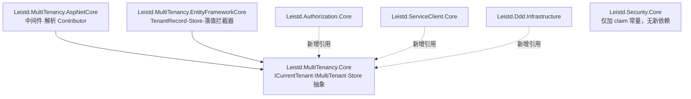
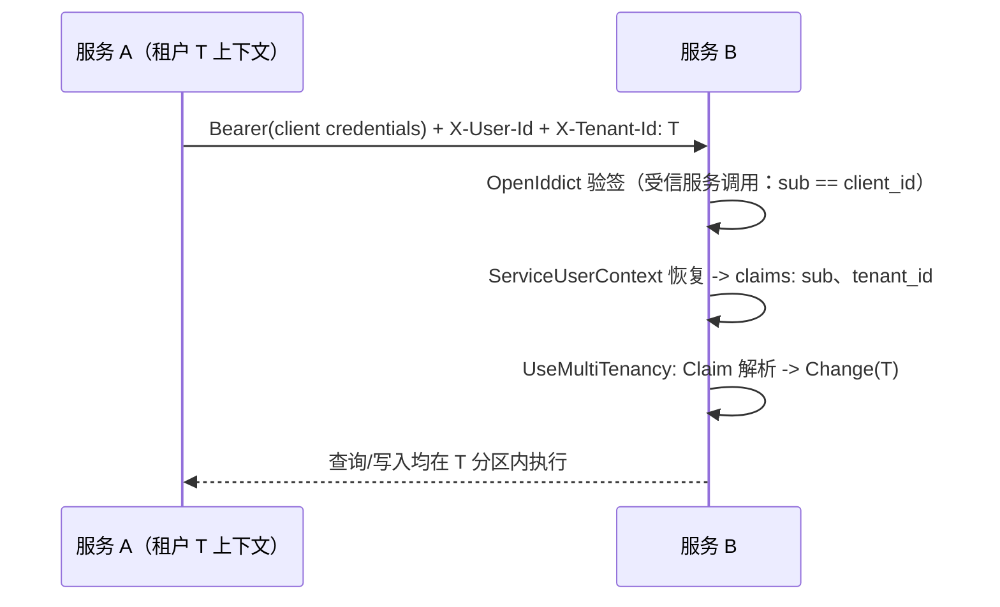

# Leistd 多租户模式技术方案

> 日期：2026-08-12
> 基线分支：`feat/multi-tenancy`（基于 `feat/frontend-spartan-migration`，已合并 `feat/service-invocation-sdk`）
> 基线提交：`db261ec`
> 参考实现：ABP Framework 10.6.0 源码（`Volo.Abp.MultiTenancy*`、`Volo.Abp.AspNetCore.MultiTenancy`、`modules/tenant-management`、`modules/permission-management`）与其开源模板生成的多租户 demo（`abp new MtDemo -t app -u angular -d ef -dbms postgresql -uost`，Angular + EF Core + PostgreSQL + TenantManagement 全开）
> 参考文档：[ABP Multi-Tenancy](https://abp.io/docs/latest/framework/architecture/multi-tenancy)、[Data Filtering](https://abp.io/docs/latest/framework/infrastructure/data-filtering)、[Tenant Management](https://abp.io/docs/latest/modules/tenant-management)

## 1. 目标

未来将基于 template 生成多个后端服务，其中很多服务需要支持多租户（SaaS）模式。当前 Leistd 框架、DDD 基座、模板与服务调用 SDK 中**不存在任何租户概念**（仓库内 grep `tenant` 仅命中测试用例的示例字符串）。本方案在 `framework/components/` 新增 **`multi-tenancy` 组件家族**，并对既有组件、DDD 基座、模板和 SDK 做最小必要适配，一次交付以下能力：

| 能力 | 交付形态 |
| --- | --- |
| 租户环境上下文 | `ICurrentTenant`（AsyncLocal，`Change()` 可嵌套切换），与 `ICurrentPrincipalAccessor` 同构 |
| 请求级租户解析 | 中间件 + 可扩展 Contributor 链（Claim → Header → QueryString），未知租户 404、停用租户 403 |
| 数据硬隔离 | `IMultiTenant` 标记接口 + EF Core 全局查询过滤器（与软删除过滤器命名共存）+ 写入时自动落 `TenantId` |
| 租户注册与管理 | 框架提供 `TenantRecord` / `ITenantStore` / `ITenantManager` 存储原语；模板提供管理 API + UI 闭环 |
| 权限租户化 | 权限定义带 Host/Tenant 侧别；授予记录按租户分区；租户管理权限仅宿主侧可见可授 |
| 跨服务租户传递 | ServiceClient 出站注入 `X-Tenant-Id`，被调方仅对受信服务调用恢复租户为 claim；不受信来源的租户头不剥离（解析链主体优先级已使其无害，匿名登录的租户选择依赖它） |
| 模板条件裁剪 | 新增 `IncludeTenancy` 参数（默认 `false`），完整裁剪实体、DI、API、前端、Mock、文档 |

### 1.1 使用场景

1. **单服务 SaaS 后台**（模板 `IncludeTenancy=true` 生成）：宿主管理员在 `/platform/tenants` 创建租户；每个租户拥有独立的用户、角色、权限授予；登录页选择租户；同一库同一 schema 内按 `TenantId` 硬隔离。
2. **多服务体系**：租户注册中心与用户、OpenIddict client 一并归**独立身份服务**（沿用服务调用 SDK 决策 D9 的单一信任锚）；身份服务签发的 token 携带 `tenant_id` claim，资源服务从已验签主体解析租户，**不需要本地租户表**；服务间调用经 `X-Tenant-Id` 受信恢复。
3. **非多租户项目**：不启用参数、不实现 `IMultiTenant`、不调用 `AddMultiTenancy*` —— 零模型成本、零运行时成本（过滤器只作用于实现了标记接口的实体）。

### 1.2 隔离模型与非目标

**隔离模型：共库共 schema**。`IMultiTenant.TenantId` 为 `Guid?`，`null` 即宿主数据——同一实体类型同时服务宿主与租户两侧（采纳 ABP "Why the TenantId Property is Nullable" 的论证，不引入 ASP.NET Boilerplate 时代的 `MustHaveTenant/MayHaveTenant` 双形态）。

**非目标**（均留有明确叠加点，不做预留代码）：

- **按租户独立数据库 / 混合模式**——ABP 靠 `MultiTenantConnectionStringResolver` 五级回退 + UoW 内按连接串键控 DbContext 实现。Leistd 模板当前是"启动时 Migrate/EnsureCreated + 单连接串"的部署形态，引入按租户连接解析将连带改造迁移策略、DbMigrator、种子与运维流程，收益不匹配当前体量。演进缝在 `Leistd.UnitOfWork.EfCore` 的 `DbContextProvider`（当前无键控直取 DI），未来加 `IConnectionStringResolver` 抽象即可，不影响本次公共 API。
- **租户级功能开关 / Edition 计费模型**——ABP Feature/Edition 体系依赖 Setting/Feature 基础设施，Leistd 无对应组件，业务项目可用自有配置表实现。
- **分布式事件的租户信封**——Leistd 只有本地事件总线，AsyncLocal 租户上下文随执行流天然穿透 handler 的新 DI scope，无需信封；未来引入分布式总线时在消息头携带 `tenantId`。
- **子域名租户解析**（`{tenant}.example.com`）——Contributor 链可扩展，业务项目按需自注册，模板不内置。
- **租户级主题 / 品牌定制**——前端交付面，另行立项。

## 2. 参考基线：ABP 机制的采纳与取舍

| ABP 机制 | 结论 | 理由 |
| --- | --- | --- |
| `ICurrentTenant` + `AsyncLocalCurrentTenantAccessor`（静态单例 AsyncLocal，`Change()` 返回还原用 `IDisposable`） | **采纳** | 与 Leistd 现有 `CurrentPrincipalAccessor` / `DataFilter<T>` 完全同构，是仓库已验证的环境上下文形态 |
| `IMultiTenant { Guid? TenantId }`，null=宿主 | **采纳** | 单一形态覆盖两侧数据，避免双接口 + 双过滤器 |
| 全局查询过滤器闭包引用 DbContext 实例属性（EF 自动参数化，运行时可开关） | **采纳** | Leistd `BaseDbContext` 软删除过滤器已用同一技巧，直接扩展 |
| `IDataFilter<IMultiTenant>` 运行时开关 | **采纳** | `Leistd.Ddd.Domain` 已有等价 `IDataFilter`，零新机制 |
| 解析链 CurrentUser → Domain → QueryString → Route → Header → Cookie（认证主体优先且终止链） | **简化采纳** | 保留"认证主体优先、终止链"的安全语义；SPA 模板只需 Claim → Header → QueryString 三级，Route/Cookie/Domain 是 MVC 多页形态的需求 |
| `MultiTenancyMiddleware`：解析 → Store 校验（不存在/停用即拒） → `Change()` 包裹后续管道 | **采纳** | 校验收口在一处；`Change` 包裹整个管道使 AsyncLocal 覆盖全请求 |
| 权限定义 `MultiTenancySides`（Host/Tenant/Both），检查、管理、列表、种子四处过滤 | **采纳** | 没有它，租户管理员会看到并可自授"管理租户"等宿主权限 |
| `PermissionGrant : IMultiTenant`，唯一索引前置 `TenantId` | **采纳** | 授予按租户分区由全局过滤器自动完成，Store 代码零改动 |
| `MultiTenantConnectionStringResolver` + `[IgnoreMultiTenancy]` DbContext | **不采纳** | 见 §1.2 非目标；`IgnoreMultiTenancy` 语义由"宿主侧实体不实现 `IMultiTenant`"天然覆盖 |
| 全局过滤器的 DbFunction SQL 优化 | **不采纳** | 参数化布尔短路已可用且与现状一致，优化属过早 |
| TenantManagement 独立模块（Domain/Application/HttpApi/Web 全套） | **收敛** | Leistd 授权体系先例：框架只交付存储原语（Record/Store/Manager），管理 API 与 UI 是模板职责 |
| 分布式缓存 key 自动加 `t:{tenantId}` 前缀 | **约定替代** | Leistd 无统一缓存组件；写入组件文档约定"缓存租户数据的 key 必须含租户 Id" |
| 后台 Job 参数实现 `IMultiTenant` 以恢复租户 | **约定替代** | Leistd 无 Job 组件；文档给出后台任务 `ICurrentTenant.Change()` 先行的模式（与 `ICurrentPrincipalAccessor.Change` 同型） |

## 3. 现状审视：各交付面适配清单

### 3.1 通用组件（18 家族）

| 家族 | 结论 | 说明 |
| --- | --- | --- |
| security | **适配** | `CustomClaimTypes` 增加 `TenantId = "tenant_id"`；`ICurrentUser` 增加 `Guid? TenantId`（读 claim）；`FakeCurrentUser` 同步 |
| authorization | **适配** | 定义增加 `MultiTenancySides`；`DefaultPermissionChecker` 校验侧别；`PermissionGrantRecord` / `AuthorizationRevisionRecord` 实现 `IMultiTenant`，唯一索引前置 `TenantId` |
| authorization-resource | **适配** | `ResourcePermissionGrantRecord` / `ResourceAuthorizationRevisionRecord` 同上按租户分区 |
| authorization-data-scope | 无需 | `DefaultDataScopeApplier` 注释已定死口径：租户隔离是 EF 全局过滤器负责的硬边界，永远 AND、不被范围并集放宽 |
| service-client | **适配** | 出站新增 `X-Tenant-Id`（来源 `ICurrentTenant`，非 claim，后台任务场景可用）；入站受信恢复 `tenant_id` claim，不受信剥离 |
| auditing | 无需 | `TenantId` 落值不属审计职责，由 multi-tenancy 自己的 SaveChanges 拦截器完成；`AuditPropertySetter` 各 setter 已是 `protected virtual`，跨租户 CreatorId 防误写作为文档注意事项 |
| event-bus | 无需 | 本地总线 handler 虽在新 DI scope 执行，但 AsyncLocal 挂在 ExecutionContext 上天然流动；分布式演进见非目标 |
| unit-of-work | 无需 | 共库模式下事务与租户无关；按租户库的演进缝在 `DbContextProvider` |
| lock | 无需（约定） | 租户级互斥操作的锁 key 必须含 `tenantId`（模板种子实现即示范） |
| notifications / realtime | 无需 | 通知与订阅均按 `userId`（全局唯一 Guid）寻址，天然隔离 |
| exception | 无需 | 新增异常沿用 `CommonException` 体系，HTTP 映射由宿主完成（同 `UndefinedPermissionException` 先例） |
| localization | 无需 | 租户级默认语言为演进项，中间件预留了切换点但本次不做 |
| tracing | 无需 | 租户日志上下文由 `MultiTenancyMiddleware` 自己压入日志 Scope（`leistd.tenantId`），不动 tracing 组件 |
| aop / core / dependency-injection / object-mapping / response | 无需 | 与租户维度正交 |

### 3.2 DDD 基座（必须修的两个既有缺陷）

| 项 | 现状 | 适配 |
| --- | --- | --- |
| `ApplyGlobalFilters<TInterface>` | 使用**非命名** `HasQueryFilter`，第二次调用会**覆盖**第一次——软删除与租户过滤器无法共存 | 重构为 EF 10 **命名查询过滤器**（`HasQueryFilter(name, expr)`），软删除、租户各占一个名字，可独立 `IgnoreQueryFilters(name)` |
| `EfCoreRepository.GetByIdAsync` | 走 `DbSet.FindAsync`，**绕过全局查询过滤器**——今天已能查出软删除行，启用租户后将成跨租户水平越权 | 改为 `FirstOrDefaultAsync(e => e.Id.Equals(id))` 走过滤查询；这是独立于多租户的正确性修复 |
| `BaseDbContext` | 仅软删除过滤器 | 叠加租户过滤器：`!IsMultiTenantFilterEnabled || EF.Property<Guid?>(e, "TenantId") == CurrentTenantId`，两个实例属性经 `_serviceProvider` 取 `IDataFilter` / `ICurrentTenant`，EF 按查询参数化；`serviceProvider == null`（设计时）与未注册 `ICurrentTenant` 时安全回退 |
| 实体基类 | 无租户形态 | 不加基类。业务实体自行实现 `IMultiTenant`（`public Guid? TenantId { get; private set; }`），落值由拦截器完成，与审计字段同型 |

### 3.3 模板与 SDK

- 模板 `User.Username` / `User.Email` 当前为**全局唯一索引**，租户化后须改为 `(TenantId, ...)` 复合唯一（PostgreSQL 用 Npgsql 的 `AreNullsDistinct(false)` 保证宿主行 `NULL` 也唯一；应用层 `UserDomainService` 的唯一性校验在租户过滤器内执行，天然按租户）。
- 模板种子 `SystemInitializer` 是单一分布式锁 + revision-0 幂等例程，需拆出可按租户复用的 `ITenantSeeder`（锁 key 加 `:{tenantId}`）。
- Cookie 主体与 OpenIddict token 均需写入 `tenant_id` claim（`AuthController.CreateCookiePrincipalAsync` 与 `AuthPrincipalFactory` 两处，同 `is_super_admin` 先例）。
- SDK（ServiceClient）用户头传递链路已就绪且经测试证明可通用映射租户头，本次将其固化为一等公民常量与默认行为。

## 4. 核心策略

### 4.1 决策基线

| # | 决策 | 结论 | 理由 |
| --- | --- | --- | --- |
| D1 | 隔离模型 | 共库共 schema（`TenantId` 列 + 全局过滤器）；按租户库列为非目标 | 见 §1.2；ABP 混合模式的复杂度主要在连接解析与迁移编排，当前无消费场景 |
| D2 | 租户形态 | 仅 `IMultiTenant { Guid? TenantId }`，null=宿主 | 单形态双侧复用；宿主侧实体（如 `TenantRecord` 自身）不实现该接口即天然免过滤 |
| D3 | 包结构 | 1 家族 3 包：`Core` / `AspNetCore` / `EntityFrameworkCore` | 与 security、authorization 家族切分标准一致：Core 平台无关，Web 与 EF 各归实现层 |
| D4 | 环境上下文 | `AsyncLocalCurrentTenantAccessor` 静态单例 + `CurrentTenant.Change()` 返回还原句柄 | 复刻 `CurrentPrincipalAccessor` 已验证形态；静态单例使拦截器等无 DI 场景可达 |
| D5 | 过滤器组合 | `ApplyGlobalFilters` 重构为命名过滤器；`GetByIdAsync` 修复绕过 | §3.2 两个既有缺陷不修，租户隔离就是漏的 |
| D6 | 解析链 | `CurrentPrincipal`（认证即终止链）→ `Header: X-Tenant-Id` → `QueryString: tenant`，链尾未解析 = 宿主 | 认证主体优先是安全要求（防止已登录用户被头/参数挪到别的租户）；匿名头解析服务于登录前选租户，认证仍发生在该租户分区内，无越权面 |
| D7 | 租户注册中心 | 框架交付 `TenantRecord` + `EfCoreTenantStore` + `TenantManager`；管理 API/UI 归模板；多服务体系中租户表只存在于身份服务，资源服务信 token claim | 授权体系"框架存储原语 + 模板管理闭环"先例；单一信任锚（SDK 决策 D9 延伸）避免每服务一张租户表的数据漂移 |
| D8 | 权限侧别 | `MultiTenancySides` 定义于 `MultiTenancy.Core`；`Authorization.Core` 引用之，定义默认 `Both`，checker 按当前侧别硬过滤（`ICurrentTenant` 未注册视为 Host） | 侧别是定义级元数据，检查点收口在 checker 一处；`GetService` 探测保证无租户项目零影响 |
| D9 | 超管与硬边界 | `IsSuperAdmin` 旁路功能权限，但**不旁路租户过滤器**；跨租户操作 = 显式 `ICurrentTenant.Change(null)`（宿主视角）或 `IDataFilter.Disable<IMultiTenant>()`（全量视角），均可审计 | 授权方案 §10 既定规则："租户隔离不可被超管随意旁路" |
| D10 | SDK 租户传递 | 出站 `TenantContextDelegatingHandler` 读 `ICurrentTenant` 注入 `X-Tenant-Id`；入站沿用 ServiceUserContext 信任判定：受信服务调用恢复为 `tenant_id` claim。**实现修正**：不受信来源的租户头**不剥离**——解析链主体优先级已使其无害（已认证主体由 claim 定案，匿名头只决定登录分区），剥离反而切断 SPA 匿名登录的租户选择 | 读 `ICurrentTenant` 而非 claim，后台任务 `Change()` 后无主体也能传；信任锚复用 client credentials 身份，不新造机制 |
| D11 | 模板参数 | `IncludeTenancy`，默认 `false`，`isEnabled: IncludeRoles` | 管理闭环依赖权限门禁与角色模型；多数服务不需要 MT，默认关闭避免为未使用能力付模型成本 |
| D12 | 租户校验与缓存 | 中间件经 `ITenantStore` 校验：未知 → `TenantNotFoundException`（映射 404），停用 → `TenantNotActiveException`（映射 403）；`EfCoreTenantStore` 经 `IDistributedCache` 缓存，`TenantManager` 写入时失效 | 校验收口一处；模板已注册 memory/Redis 分布式缓存，租户配置极小适合缓存 |

### 4.2 组件划分



| 包 | 角色 | 内容 | 依赖 |
| --- | --- | --- | --- |
| `Leistd.MultiTenancy.Core`（RootNamespace `Leistd.MultiTenancy`） | 平台无关抽象与默认实现 | `IMultiTenant`、`ICurrentTenant` / `CurrentTenant`、`ICurrentTenantAccessor` / `AsyncLocalCurrentTenantAccessor`、`BasicTenantInfo`、`MultiTenancySides`、`ITenantStore` / `TenantConfiguration`、`ITenantNormalizer`、`ITenantResolveContributor` / `TenantResolveContext` / `ITenantResolver`、`TenantNotFoundException` / `TenantNotActiveException`、`AddMultiTenancyCore()` | `Leistd.Core` |
| `Leistd.MultiTenancy.AspNetCore` | Web 宿主集成 | `MultiTenancyMiddleware`（解析 → Store 校验 → `Change` 包裹管道 → 日志 Scope `leistd.tenantId`）、`CurrentPrincipalTenantResolveContributor` / `HeaderTenantResolveContributor` / `QueryStringTenantResolveContributor`、`MultiTenancyOptions`（头名、查询串名、Contributor 链）、`AddMultiTenancy(IConfiguration \| Action)` + `UseMultiTenancy()` | `MultiTenancy.Core`、`FrameworkReference Microsoft.AspNetCore.App` |
| `Leistd.MultiTenancy.EntityFrameworkCore` | 持久化集成 | `TenantRecord`（Guid v7、Name 归一化唯一、DisplayName、IsActive、全审计软删，**不实现** `IMultiTenant`）、`EfCoreTenantStore<TDbContext>`（IDistributedCache 缓存）、`ITenantManager` / `EfCoreTenantManager`（创建/改名/启停，归一化 + 唯一校验 + 缓存失效）、`MultiTenantSaveChangesInterceptor`（Added 且 `IMultiTenant` 且 `TenantId == null` 时落当前租户）、`ConfigureMultiTenancy(this ModelBuilder)`、`AddMultiTenancyEfCore<TDbContext>()` | `MultiTenancy.Core`、`Auditing.Core`、EF Core |

既有包的增量（均为最小侵入）：

- `Leistd.Security.Core`：`CustomClaimTypes.TenantId = "tenant_id"`；`ICurrentUser.TenantId`。
- `Leistd.Authorization.Core`：`PermissionGroupDefinition` / `PermissionDefinition` 增加 `MultiTenancySides Side { get; set; } = Both`（`AddGroup` / `AddPermission` / `AddChild` 加可选参）；`DefaultPermissionChecker` 在定义校验处追加侧别匹配（不匹配即拒，先于授予读取）。
- `Leistd.Authorization.EntityFrameworkCore` / `Resource.EntityFrameworkCore`：4 张授予/版本表实现 `IMultiTenant`，唯一索引改为 `TenantId` 前置（Npgsql `AreNullsDistinct(false)`）。
- `Leistd.ServiceClient.Core`：`ServiceClientHeaders.TenantId = "X-Tenant-Id"`；`TenantContextDelegatingHandler`（`ICurrentTenant` 可选探测，同 `ICurrentUser` 先例）；管道插在用户头之后、Bearer 之前。
- `Leistd.ServiceClient.AspNetCore`：`ServiceUserContextOptions` 增加 `TenantIdHeader`（默认 `X-Tenant-Id`），受信恢复时写入 `tenant_id` claim，不受信剥离清单加入该头。
- `Leistd.Ddd.Infrastructure`：`BaseDbContext` 叠加租户命名过滤器；`ApplyGlobalFilters` 命名化重构；`EfCoreRepository.GetByIdAsync` 修复；`AddDddInfrastructure()` 不自动注册租户服务（保持"宿主显式组合"）。

### 4.3 一次请求中的标准执行链

```text
UseAuthentication                     # 主体就绪（cookie / Bearer）
  -> UseServiceUserContext            # 受信服务调用恢复 X-User-* / X-Tenant-Id -> claims
  -> UseMultiTenancy                  # Claim -> Header -> Query 解析；Store 校验；Change() 包裹后续管道
  -> UseAuthorization                 # 权限检查（含侧别匹配）在租户上下文内执行
  -> Controller / AppService
       -> IRepository 查询            # 全局过滤器：软删除 AND TenantId == CurrentTenantId
       -> SaveChanges                 # 审计拦截器落审计字段；租户拦截器落 TenantId
```

解析语义细则：

- 认证主体存在 `tenant_id` claim → 该值定案且终止链（含"宿主用户"= 无 claim 也定案为宿主），头与查询串无法改写已登录用户的租户——这是防水平越权的关键顺序。
- 匿名请求头/查询串解析仅决定"后续认证发生在哪个租户分区"（登录、注册），本身不授予任何数据可见性。
- 链尾无结果 = 宿主上下文，不是错误；解析出的租户经 Store 校验失败才抛异常。

### 4.4 数据隔离机制

```csharp
// BaseDbContext.OnModelCreating —— 两个命名过滤器按接口各自套用，EF 组合为 AND
modelBuilder.ApplyGlobalFilters<ISoftDelete>("SoftDelete",
    e => !IsSoftDeleteFilterEnabled || !EF.Property<bool>(e, nameof(ISoftDelete.IsDeleted)));
modelBuilder.ApplyGlobalFilters<IMultiTenant>("MultiTenant",
    e => !IsMultiTenantFilterEnabled || EF.Property<Guid?>(e, nameof(IMultiTenant.TenantId)) == CurrentTenantId);

protected virtual Guid? CurrentTenantId => _serviceProvider?.GetService<ICurrentTenant>()?.Id;
protected virtual bool IsMultiTenantFilterEnabled =>
    _serviceProvider?.GetService<IDataFilter>()?.IsEnabled<IMultiTenant>() ?? true;
```

- 两个实例属性被 EF 捕获为查询参数，每次执行重估——`Change()` 切换与 `IDataFilter` 开关即时生效，无需重建模型（与现有软删除过滤器同一机制，无需自定义编译查询缓存键）。
- 落值：`MultiTenantSaveChangesInterceptor` 仅处理 `Added` 且值仍为 `null` 的实体（经 `entry.Property(...).CurrentValue` 写私有 setter）；实体构造期需要租户值的场景由聚合显式传参，不做 ABP 的实体构造函数静态取值（Leistd 实体不做服务定位）。
- 越权语义：租户上下文内按 Id 取他租户实体 → 过滤器使其"不可见"，统一表现为 404（与授权方案的资源不可见口径一致）。
- 宿主视角（`TenantId == null` 行）与全量视角（`Disable<IMultiTenant>()`）语义不同，组件文档必须分别给出示例与警告。

### 4.5 权限与租户的交汇

1. **侧别过滤**：`App.Tenants.*` 声明为 `MultiTenancySides.Host`——租户侧用户在定义树中看不到、无法被授予、checker 直接拒绝。业务权限默认 `Both`。
2. **授予分区**：授予/版本记录实现 `IMultiTenant` 后，`EfCorePermissionGrantStore` 的既有查询经全局过滤器自动按租户分区，Store 与 Manager 代码零改动；revision 乐观并发在租户内独立演进。
3. **超管边界**：租户内 `IsSuperAdmin` 用户旁路本租户功能权限，不能越过租户过滤器；宿主超管管理租户走 Host 侧权限 + 宿主上下文，不触碰租户业务数据。
4. **种子**：每个租户创建时在 `Change(tenant.Id)` 内执行 `ITenantSeeder`——初始化 Admin/Member 角色、把当前**Tenant 侧可见**的全部权限定义授予 Admin 角色、创建租户管理员（邮箱/初始密码来自创建入参）。

### 4.6 跨服务租户传递



- 出站头来源是 `ICurrentTenant`（环境上下文）而非用户 claim：后台任务 `Change(tenantId)` 后无主体也能正确传递。
- 不受信请求携带的 `X-Tenant-Id` 无需剥离（实现修正）：已认证主体的租户由 claim 定案、头被解析链忽略；匿名头只决定「后续认证发生在哪个租户分区」，不授予可见性——租户上下文的改写只能通过登录（进入 token claim）或受信服务通道。用户头（X-User-*）仍按原口径对不受信来源剥离。
- 用户 token 场景无需该头：`tenant_id` 已在 token 内随主体传递。

### 4.7 模板闭环

**后端**（全部受 `#if IncludeTenancy` 裁剪）：

| API | 用途 | 保护 |
| --- | --- | --- |
| `GET /api/v1/tenants`（分页）/ `GET {id}` | 租户列表与详情 | `App.Tenants.Default`（Host 侧） |
| `POST /api/v1/tenants` | 创建租户 + 租内种子（管理员邮箱/初始密码入参） | `App.Tenants.Create` |
| `PUT /api/v1/tenants/{id}` / `PUT {id}/activation` | 改名、启停 | `App.Tenants.Update` |
| `DELETE /api/v1/tenants/{id}` | 软删（连带使 Store 缓存失效，租户用户下次请求即 403/404） | `App.Tenants.Delete` |
| `GET /api/v1/tenants/by-name/{name}` | 登录前租户探测（返回 Id 与 IsActive，不泄露其他信息） | 匿名 |

其余后端改造：`User`/`Role`/`UserRole`/`ExternalLoginConnection` 实现 `IMultiTenant`；用户名/邮箱唯一索引改 `(TenantId, ...)`；两条认证路径写 `tenant_id` claim；`PermissionSubjectProvider` / `ActiveUserHandler` 的按请求用户重读天然落在租户分区内（无需改动，测试覆盖即可）；`SystemInitializer` 拆分宿主初始化与 `ITenantSeeder`；`Program.cs` 注册 `AddMultiTenancyCore/AddMultiTenancy/AddMultiTenancyEfCore` 并在 `UseServiceUserContext` 之后 `UseMultiTenancy()`，DbContext options 追加租户拦截器。

**前端**：

- 登录页租户选择区（名称输入 + `by-name` 校验，宿主登录留空），选择结果存 `localStorage`；参照 ABP tenant box 的语义——租户框只决定"后续认证发生在哪个租户分区"，本身不授予任何可见性。
- `tenant-interceptor`（先例：`accept-language-interceptor`）为所有 `/api/` 请求附加 `X-Tenant-Id`。
- **当前租户显示与切换**：登录后在 `user-menu` 区域展示当前租户名（宿主显示"宿主"）；"切换租户"入口 = 清 `localStorage` 租户状态 + 登出回登录页重选——`tenant_id` 已固化在 cookie/token 主体且解析链上 claim 优先，不存在"原会话内热切换"，前端不做假切换（对应 ABP "CurrentUser 解析链首 + 切换即重新登录"的语义）。
- **租户失效兜底**：租户被停用/删除后，在途会话的下一个请求即被中间件拒绝（403/404 + 业务 code）；`httpErrorInterceptor` 识别租户失效错误码后清 `localStorage` 租户状态并跳登录页（对应 ABP `MultiTenancyMiddlewareErrorPageBuilder` 清 cookie + SignOut 的职责，SPA 形态下收敛为清本地状态 + 重登）。
- **匿名流程带租户**：邮件验证、找回密码等匿名链路的邮件链接嵌入 `?tenant={tenantId}` 查询参数（QueryString Contributor 承接，先例：ABP 密码重置链接嵌 `__tenant`）；`IncludeTenancy && IncludeIdentity` 组合下 `EmailVerificationAppService` 发信时从 `ICurrentTenant` 取值拼装。
- `/platform/tenants` 管理页（Spartan 表格 + Dialog，先例：roles 页面），路由 `permissionGuard` 挂 `App.Tenants.Default`；租户侧用户因侧别过滤天然看不到该权限，菜单自动裁剪。既有用户/角色/权限管理页**零改动**——后端查询天然落在当前租户分区内，页面语义自动变为"本租户的用户/角色/授予"。
- Mock 三件套（`_mock/data/tenant.ts`、`_mock/api/tenant.ts`、`index.ts` 出口）复刻端点形状、401/403、"停用租户登录被拒"与租户失效错误码，不复刻解析引擎。

**条件裁剪**：`template.json` 增 symbol `IncludeTenancy`（`isEnabled: IncludeRoles`，默认 false）+ modifier 排除清单（tenant 实体配置、Controller、AppService、前端页面/服务/Mock）；`!IncludeIdentity` 与 `IncludeIdentity && !IncludeRoles` 清单同步补全（modifiers 不级联）；矩阵新增 `tenancy` 场景并为既有场景添加 `ForbiddenTokens: ["X-Tenant-Id", "IMultiTenant", "App.Tenants"]`。

### 4.8 文件树

```
framework/components/multi-tenancy/
├── Leistd.MultiTenancy.Core/
│   ├── Leistd.MultiTenancy.Core.csproj            # RootNamespace: Leistd.MultiTenancy
│   ├── DependencyInjection.cs                     # AddMultiTenancyCore()
│   ├── IMultiTenant.cs
│   ├── MultiTenancySides.cs                       # Tenant=1, Host=2, Both=3（Flags）
│   ├── CurrentTenant/
│   │   ├── ICurrentTenant.cs                      # IsAvailable / Id / Name / Change(id, name)
│   │   ├── CurrentTenant.cs
│   │   ├── ICurrentTenantAccessor.cs
│   │   ├── AsyncLocalCurrentTenantAccessor.cs     # 静态单例
│   │   └── BasicTenantInfo.cs
│   ├── Resolution/
│   │   ├── ITenantResolver.cs / TenantResolver.cs
│   │   ├── ITenantResolveContributor.cs
│   │   └── TenantResolveContext.cs                # TenantIdOrName + Handled（可解析为“确定是宿主”）
│   ├── Store/
│   │   ├── ITenantStore.cs                        # FindAsync(id) / FindByNameAsync(normalizedName)
│   │   ├── TenantConfiguration.cs                 # Id / Name / NormalizedName / IsActive
│   │   ├── ITenantNormalizer.cs / UpperInvariantTenantNormalizer.cs
│   │   └── InMemoryTenantStore.cs                 # 资源服务/测试用的配置型 Store
│   └── Exceptions/
│       ├── TenantNotFoundException.cs             # : CommonException
│       └── TenantNotActiveException.cs
├── Leistd.MultiTenancy.AspNetCore/
│   ├── Leistd.MultiTenancy.AspNetCore.csproj
│   ├── DependencyInjection.cs                     # AddMultiTenancy(IConfiguration|Action) / UseMultiTenancy()
│   ├── Options/MultiTenancyOptions.cs             # HeaderName=X-Tenant-Id、QueryStringName=tenant、Contributor 链
│   ├── MultiTenancyMiddleware.cs                  # 解析→校验→Change 包裹→日志 Scope
│   └── Resolution/
│       ├── CurrentPrincipalTenantResolveContributor.cs
│       ├── HeaderTenantResolveContributor.cs
│       └── QueryStringTenantResolveContributor.cs
└── Leistd.MultiTenancy.EntityFrameworkCore/
    ├── Leistd.MultiTenancy.EntityFrameworkCore.csproj
    ├── DependencyInjection.cs                     # AddMultiTenancyEfCore<TDbContext>() / ConfigureMultiTenancy(ModelBuilder)
    ├── Entities/TenantRecord.cs
    ├── Stores/EfCoreTenantStore.cs                # + IDistributedCache 缓存
    ├── Managers/ITenantManager.cs / EfCoreTenantManager.cs
    └── Interceptors/MultiTenantSaveChangesInterceptor.cs

framework/tests/
└── Leistd.MultiTenancy.Tests/                     # 单元 + Sqlite 过滤器 + TestServer 中间件端到端
    ├── CurrentTenantTests.cs                      # Change 嵌套还原、跨 await 流动、跨 DI scope 流动
    ├── TenantResolverTests.cs                     # 链序、claim 终止链、匿名头解析、未解析=宿主
    ├── MultiTenancyMiddlewareTests.cs             # 404/403、Change 覆盖管道、日志 Scope
    ├── TenantStoreTests.cs                        # 归一化、缓存命中/失效、软删租户不可见
    ├── MultiTenantFilterTests.cs                  # Sqlite：双过滤器共存、跨租户 GetByIdAsync 不可见、Disable/Change(null) 语义
    └── TenantStampingInterceptorTests.cs          # 落值、显式赋值不覆盖、宿主上下文落 null

framework/docs/components/multi-tenancy.md         # 组件使用文档（随包分发）
```

### 4.9 开发标准遵循

- csproj 极简（共享属性来自 `common.props`），CPM 无版本号，第三方新依赖为零；`*.Core` 不引 Web/EF/Castle；ASP.NET Core 能力用 `FrameworkReference`。
- 公共 API 全量 XML 注释；组件文档示例只用本组件真实依赖 + 原生 .NET/EF Core，不出现 `IRepository<>` 等 ddd-struct 类型（DDD 组合示例归 `framework/docs/ddd-struct/ddd-struct.md`）。
- DI 形态：`TryAdd*` 注册可替换服务（`ITenantStore` 等）；两段式 `Add*(IConfiguration)` / `Add*(Action<TOptions>)`；配置节 `Leistd:MultiTenancy`。
- 测试：xunit + 手写 Fake（`Leistd.TestBase` 增 `FakeCurrentTenant`）；过滤器与唯一索引断言跑 **Sqlite**（InMemory 无法证伪可翻译性与索引）。

## 5. 实施计划

### 阶段 1：Framework 基座（multi-tenancy 家族 + ddd-struct 修复）

1. 建三个项目入 `Leistd.Framework.slnx`；实现 Core（上下文、解析、Store 抽象、异常）、AspNetCore（中间件 + 三个 Contributor）、EntityFrameworkCore（Record/Store/Manager/拦截器）。
2. ddd-struct：命名过滤器重构 `ApplyGlobalFilters`、`BaseDbContext` 叠加租户过滤器、`GetByIdAsync` 修复（连带补软删除回归测试——这是既有缺陷的修复证据）。
3. `Leistd.Security.Core` 增 claim 常量与 `ICurrentUser.TenantId`；`Leistd.TestBase` 增 Fake。
4. `Leistd.MultiTenancy.Tests` 全量 + `Leistd.Ddd.Infrastructure.Tests` 补过滤器矩阵。

**验收**：`dotnet build/test` 全绿；`dotnet pack` 至 `.tmp/local-feed`；`test-package-consumption.ps1 -PackageIds` 三新包通过。

### 阶段 2：授权与 SDK 集成

1. `Authorization.Core` 侧别（定义 API + checker 过滤 + 单元测试：Host 权限在租户上下文被拒、未注册 `ICurrentTenant` 视为 Host）。
2. 授予/版本 4 表 `IMultiTenant` 化与索引调整（升级需一次 EF 迁移，写入 versioning 指引）。**实现修正**：不用 Npgsql 专属 NULLS NOT DISTINCT，改为宿主行（IS NULL 过滤）与租户行（IS NOT NULL 过滤）成对的带过滤唯一索引——可空列直接进唯一索引时 PostgreSQL/Sqlite 均视 NULL 互不相等，宿主行会失去唯一性与并发首写兜底。
3. ServiceClient 出站 handler + 入站恢复/剥离 + 测试（含伪造 `X-Tenant-Id` 被剥离、后台任务 `Change` 后传递、`Leistd.Authorization.Pipeline.Tests` 补跨租户越权矩阵）。

**验收**：授权管道端到端测试含"租户 A 主体查不到租户 B 授予、Host 权限对租户拒绝、超管不越租户过滤器"。

### 阶段 3：文档与版本

1. `framework/docs/components/multi-tenancy.md`（何时使用/安装/配置/使用/接口参考/实现行为/注意事项——宿主视角 vs 全量视角、缓存 key 约定、后台任务模式、锁 key 约定）；组件总览 README 清单与依赖图更新；security / authorization / service-client / ddd-struct 四篇文档同步增量。
2. `docs/framework/versioning.md` 登记新包与破坏性变更（`ICurrentUser` 新成员、授予表索引迁移、`ApplyGlobalFilters` 签名变化）。
3. `check-docs-sync.ps1` / `check-docs-api-drift.ps1` 通过。

### 阶段 4：Template 后端

1. `IncludeTenancy` 参数与全套 modifier；实体租户化 + 唯一索引调整；两条认证路径写 claim；`Program.cs` 组合；种子拆分 `ITenantSeeder`。
2. Tenant 管理 API（§4.7 表）+ `App.Tenants.*` Host 侧权限定义。
3. 集成测试：租户创建即种子、租户登录、跨租户数据不可见（用户列表/详情/更新三路）、停用租户 403、宿主管理员不可见租户业务数据、`by-name` 匿名探测。
4. **实施中发现并修复的两个合并遗留缺陷**（上游两分支各自绿、合并组合从未测过）：
   - spartan 分支给机器主体 `sub` 加 `client:` 前缀（防 client_id 冒充 GUID 用户），SDK 受信判定要求 `sub == client_id` 严格相等——合并后受信恢复永远失败。修复：框架受信判定兼容前缀形态（`ServiceUserContextOptions.ClientSubjectPrefix`，默认 `client:`）。
   - OpenIddict 为默认认证方案时，cookie 会话在 `UseAuthentication` 阶段是匿名的（默认策略在授权阶段才按 scheme 重认证），多租户中间件的 Claim 定案失效、伪造租户头可改写已登录会话。修复：租户+OpenIddict 组合下模板默认认证方案改为按请求选择的转发方案（Bearer 头 → OpenIddict 校验，其余 → Cookie）。
5. **有头浏览器端到端闭环发现并修复的三个缺陷**（集成测试与矩阵都测不出、只有真实浏览器多场景串联才暴露）：
   - 租户超管的菜单里出现"租户管理"（点进去必然 403）：检查器有侧别硬边界，但 current 权限与定义树端点对超管直接下发全部定义。修复：`PermissionAppService` 三处下发全部按当前侧别过滤，并补集成测试。
   - 租户被停用后，持该租户会话的用户被**死锁**在原始 JSON 错误页（HTML 导航、登录页、注销端点全部 403）。修复：新增 `TenantSessionRecoveryMiddleware`——已认证会话命中租户不可用异常时注销 Cookie，HTML 导航重定向自恢复、XHR 回 401（对应 ABP error-page-builder 的同类处理）。
   - 前端启动的租户有效性校验是 fire-and-forget 且校验请求自带失效租户头（先被 403 拒绝，形成鸡生蛋）。修复：校验改为阻塞在认证初始化之前；`tenant-interceptor` 对宿主级匿名探测端点（`by-name`）不附租户头。
6. **代码审查采纳的修复**（评审意见逐条判断后落地，未采纳项附理由）：
   - **参数依赖收口**：新增 `TenancyEnabled` computed symbol（`IncludeTenancy && IncludeRoles`），全部租户条件（内容条件与 modifier）引用它。`dotnet new` 没有"拒绝参数组合"的机制，而复合条件直接引用被禁用参数会 NRE（见 §实施记录）；computed symbol 两者都绕开——非法组合 `--include-tenancy true --include-roles false` 整体不生成租户能力，得到合法的无租户项目。矩阵新增 `tenancy-illegal` 场景断言零残留。
   - **外部登录连接租户化**：`ExternalLoginConnection` 实现 `IMultiTenant`，唯一索引改为宿主/租户成对部分索引。第三方身份的 `(Provider, ProviderUserId)` 只在租户内唯一，不分区会让跨租户登录命中别租户的绑定（泄漏占用状态），并阻止同一账号在多租户各自绑定。查询侧无需改动——全局过滤器自动分区。矩阵新增 `tenancy-external-login` 组合场景。
   - **唯一性下沉数据库**：`TenantRecord.NormalizedName` 改为未删除行上的部分唯一索引（保留删除后可复用），管理器把冲突翻译成 `DuplicateTenantNameException`；模板 `User`/`Role` 的租户唯一索引拆成宿主行（`IS NULL`）与租户行（`IS NOT NULL`）成对形态——可空列直接进唯一索引时两个 Provider 都视 NULL 互不相等，宿主行会失去兜底。Sqlite 测试真实验证约束与翻译。
   - **创建失败补偿**：种子失败时删除租户记录并重抛（补偿用独立取消令牌，避免调用方超时连带取消清理）。不采用单事务：种子内持有分布式锁，圈进数据库事务会把锁与事务生命周期绑死，且模板无 `[UnitOfWork]` 先例、集成测试跑在不支持事务的 InMemory 上——代价大于收益。失败注入测试断言无残留且名称可立即重用。
   - **未采纳**：`UserRole` 租户化（其全部查询谓词都是全局唯一的 `UserId`/`RoleId`，结构上不可能跨租户命中，加列纯冗余）；集成测试基座 InMemory→关系库（会动所有既有测试的行为基线，超出多租户范围；唯一索引与 NULL 语义已由框架侧 Sqlite 测试覆盖，作为已知限制记录）；`tenancy+localization/notifications` 组合矩阵（维度与租户正交，只会让矩阵爆炸）。
7. **第二轮审查采纳的修复**：
   - **补偿覆盖种子数据**：`ITenantSeeder.PurgeAsync` 与种子同处一个实现（改种子即见补偿），创建失败时先清租内数据再软删注册表。测试改为**部分播种后失败**（角色与授予已落库、用户未写入），并用模型驱动的类型清单锁住完整性——新增租户化实体时清单断言先失败，提醒同步补偿。未采用单事务：框架的 EF 管理器与仓储分处不同工作单元作用域，`[UnitOfWork]` 圈不住注册表写入，而 InMemory 测试基座下事务是 no-op、回滚无法验证。
   - **管理契约移入 Core**：`ITenantManager`、`TenantPage`、`DuplicateTenantNameException` 迁至 `Leistd.MultiTenancy.Core`，出参统一为 `TenantConfiguration`（补 `DisplayName`/`CreationTime`，与 Store 共用），`TenantRecord` 退回持久化实体角色。模板 Application 层不再引用任何多租户 EF 包，恢复既定依赖方向。
   - **冲突翻译收窄**：翻译前的同名查询排除本次写入的行——此前更新操作因其它约束失败时会命中自己，把任何写入错误误报成"名称重复"。新增两个测试：用 SaveChanges 拦截器在 flush 前注入竞争写入（唯一能越过预检的时点，旧测试因竞争者提前提交而空转）、以及非名称约束失败不被误报。
   - **spec 随功能裁剪**：三个租户 spec 加入 modifier 排除清单并在矩阵 `Absent` 中断言。
   - **租户页组件测试**：按 `roles.spec.ts` 的标尺补 5 个用例（分页与 URL 双向、搜索防抖回到首页、启停确认后刷新、取消删除不调接口）。

8. **实施中发现并修复的框架级隔离缺口**（审查未提及，由补偿测试暴露）：
   `BaseDbContext` 原先在 `base.OnModelCreating` 里套用全局过滤器，而派生类随后经 `ApplyConfiguration` 才把组件实体加入模型——**没有 `DbSet` 声明的实体（如 `AuthorizationRevisionRecord`）完全没有软删除与租户过滤器**，实测在租户上下文内可见其它租户的行。修复：`OnModelCreating` 改为 sealed，派生类改写新增的 `ConfigureModel`，过滤器由基类在其后套用，覆盖完整性不再依赖派生类的书写顺序。新增回归测试：一个只经 `ApplyConfiguration` 进入模型的租户化实体，必须同样被过滤。

9. **第三轮审查采纳的修复**：
   - **补偿改在独立 DI 作用域执行**：失败现场的 DbContext 仍跟踪着写入失败的实体（EF 在 SaveChanges 失败后不回滚跟踪状态），用它清理会让补偿的 `SaveChanges` 把那些实体一起写进库——补偿反而制造残留。新作用域拿到干净上下文；补偿两步各自兜异常，失败只记 Error 日志，既不覆盖原始种子异常也不阻止注册表删除。测试在桩里留下未提交的 `Added` 实体（等价于保存失败后的残留），断言它没有被补偿写入；并做了**反向验证**——把补偿退化成复用失败现场作用域，该断言立即变红，证明测试确实能捕获这个缺陷。未引入重试队列或对账作业：那是分布式事务基础设施，不属于模板范围，补偿失败以日志暴露交由运维核查。
   - **管理器只丢弃本次条目**：移除 `ChangeTracker.Clear()`（对紧随其后的 `AsNoTracking` 判定查询本就多余），改为按授权管理器的既有模式只处理本次 entry——`Added` 脱离跟踪、`Modified` 恢复原值后置 `Unchanged`。补两个测试：名称冲突时调用方的无关待提交实体仍可正常落库；保存失败后失败的改名已从跟踪器回滚（走 CHECK 约束触发的真实保存失败路径，覆盖 `Modified` 分支）。
   - **租户 widget 组件测试**：按 `role-table.spec.ts` 的标尺补表格 spec，按对话框 spec 的形态补编辑对话框 spec（创建/编辑双模式差异与输出 DTO）。
   - **未采纳**：API 错误与加载/空状态（同级页面均未覆盖，超出既有标尺）。（本轮"父组件保存链路不补"的判断在第四轮被推翻，见 §10。）

10. **第四轮审查采纳的修复**：
    - **租户停用态创建、种子成功后才激活**：`ITenantManager.CreateAsync` 增 `isActive` 形参，模板以 `isActive: false` 建租户、种子完成后 `SetActiveAsync(id, true)`。租户一旦启用中间件就接受它，而此刻还没有管理员与权限授予——匿名注册端点带上 `X-Tenant-Id` 就能在半成品租户里注册出第一个用户；补偿删除若也失败，留下的更是一个永久可用、无管理员的租户。停用态创建把这个窗口整体关掉：最坏情况残留的是一个不对外服务的租户。激活失败不触发补偿——数据已完整，停用是安全的失败态，宿主管理员启用即可，删掉一个完整租户损失更大。新增两个集成测试：种子进行中的匿名注册探测必须得到 403（**反向验证**：改回启用态创建后探测返回 400——请求真的进到了租户内部，只是被表单校验挡下）；激活失败后租户保持停用且种子数据完好。
    - **补偿两步各自独立作用域**：清种子与删注册表分别新建 DI 作用域。"失败现场的上下文不能用于补偿"这条同样适用于补偿内部——清种子的 `SaveChanges` 失败会在跟踪器里留下实体，删注册表复用同一上下文就会把它们一起写出去，甚至因它们再次失败，于是租户既没清干净又留在注册表里对外可用。新增测试：清种子留下脏跟踪器并抛错时，注册表删除仍然成功且脏实体没有落库（**反向验证**：两步合回一个作用域，断言立即变红）。
    - **跟踪器测试改走真实竞争路径**：`Name_conflict_does_not_discard_unrelated_pending_changes` 原先用重名触发**预检**拒绝，而预检路径根本不调 `SaveChanges`、跟踪器无人触碰——即使实现里放着 `ChangeTracker.Clear()` 用例也是绿的。改为复用 `RaceInjectingInterceptor`：预检通过、唯一索引在 flush 时冲突，才真正执行到丢弃逻辑。**反向验证**通过：恢复 `ChangeTracker.Clear()` 后用例变红。（这是同一类"测试没走到目标分支"的问题第三次出现，已作为固定收尾动作：每个回归测试都要先把修复退回去确认它变红。）
    - **父组件写操作闭环**（推翻第三轮判断）：补 4 个用例——新建走 `createTenant`、编辑带 Id 走 `updateTenant`、成功后关对话框并刷列表、失败保持对话框打开（关掉等于连用户填的表单一起丢）、确认删除后调接口并刷列表。**反向验证**通过：把创建/编辑三元分支调换，两个路由用例同时变红。相邻 `users`/`roles` 页面存在同类债务不构成跳过本页关键闭环的理由——那是它们各自的债，不是本页可以不测的许可。
    - **断言辅助方法显式接收宿主**：补偿测试里的数据断言不再走 `_factory.Services`，而是显式传入 `WithWebHostBuilder` 派生出的宿主。派生宿主与工厂共用同一个 InMemory 库（`databaseName` 是工厂的实例字段），断言碰巧成立——一旦改成每宿主独立库就会静默失效。名称重用那一步仍刻意走健康宿主，并在注释里写明它依赖的正是这个共库事实。

11. **第五轮审查采纳的修复**：
    - **租户缓存改绝对过期**（`EfCoreTenantStore.CacheDuration`，1 分钟）。问题的要害不是 cache-aside 本身——先提交库再失效是正确顺序，反过来会被并发读重新填充陈旧值——而是**滑动过期让暴露窗口没有上界**：持续有流量的租户，其陈旧的"启用"条目被每个请求续命而永不过期，停用一个繁忙租户可能永远不生效。绝对过期把失效失败的后果收成"最多 1 分钟后自愈"，与风险表里 `ActiveUserRequirement`"每请求重读"的防线同型，只留一层薄缓存；代价可忽略（1000 req/min 的租户仍有 999 次命中）。失效失败仍然抛异常：库为准、重试即自愈（写路径读库不读缓存），咽下去报成功会让管理员以为租户已经停了。新增测试锁死两件事：库已提交而失效失败时异常上抛且库中状态生效（停用/删除各一例）；缓存条目策略是绝对过期而非滑动（**反向验证**通过——改回滑动立即变红。这条断言不可能由行为测试观察到，要观察得等真实时钟走过过期点）。
      - **未采纳**"将启停状态移出非强一致缓存"（等于每请求一次库查询，为一个 1 分钟的上界付全量成本）与"可证明版本一致的缓存方案"（版本号本身还是要读缓存，只是把问题推给另一个键，属于分布式一致性基础设施，不在组件范围）。需要更严撤销时序的服务替换 `ITenantStore` 实现即可。
      - 顺带纠正 `TenantAppService` 注释里"激活失败必然保持停用"这个**过强的断言**：库写入前失败才保持停用，库已提交而缓存失效失败时库中已是启用态。两种情形都不会让无管理员的租户变可用（种子已成功），但注释不能这么写。
    - **`isActive` 取消默认值**：最危险的取值不该是最省事的写法。签名改为 `CreateAsync(name, displayName, isActive, ct = default)`，保留自然字段顺序，`displayName` 一并显式化。下游消费者在创建后追加播种逻辑时，编译器强制它面对这个选择。
    - **补齐公共 API 注释契约**：`ITenantManager` 全部形参的 `<param>` 加上 `<returns>` / `<exception>`，消除 3 个 CS1573（是上一轮引入的——当时只 grep 了 `error` 没看 warning，已把"检查 warning"加进收尾动作）。全仓 warning 扫描顺带清掉本家族引入的 NU1510（`Microsoft.Extensions.Caching.Memory` 由 `Microsoft.AspNetCore.App` 共享框架提供，无需单独引用）；仅剩一个与本特性无关的既有 NU1903（`AutoMapper` 13.0.1 已知高危漏洞，需单独排期升级）。
    - **未采纳：Provisioning / Active / Inactive 三态生命周期。** 两个 P1 的行为主体不同，这决定定级：匿名注册那条的主体是无权限者（越权），而"第二位宿主管理员手动激活/删除半成品租户"的主体**本来就能创建租户、启停任意租户、删除任意租户、给自己授任意权限**——是完整权限者在自己权限内做蠢事，不是权限边界被突破。最坏后果是数据落在软删租户 Id 下成为不可达的孤儿行，而这正是软删除的既定语义（已有用例锁定）。代价一侧要动框架契约枚举、两个 DTO、三个 AppService 写方法的状态守卫、前端状态渲染与操作可用性、Mock、i18n；换来的**唯一**收益是拦住三个控制面操作被特权者抢跑，数据面行为一个字不变（Provisioning 照样 403）。
      - 也评估并否决了"注册表行最后写"（先生成 Id、在该 Id 下播种、成功后才插入 active 行）：它连窗口都不存在且代码更少，但进程中途崩溃会留下无注册表行、无名称索引、谁也找不到的孤儿数据；现在崩溃留下的是管理员看得见、点一下能删的停用租户，运维上明显更好。
      - **触发条件（记档给后续接手的人）**：播种从同步转为异步（队列/worker、耗时以分钟计）时，这个窗口从亚秒级变成分钟级、跨请求、无人守护，三态状态机就从过度设计变成必需品。

12. **第六轮审查采纳的修复**：
    - **删掉租户存储的缓存，直接读库。** 上一轮我把滑动过期改成 1 分钟绝对过期，并声称"重试即自愈"——**对删除不成立**：`DeleteAsync` 先经 `GetAsync` 的 `!IsDeleted` 前置查询，租户已软删后按 Id 找不到它，直接抛 `TenantNotFoundException`，连再试一次失效的机会都没有。也就是说删除后陈旧的"启用"条目在 TTL 内没有任何补救手段。这条指控成立，我上轮的判断错了。
      - 终局是删掉缓存，不是继续给它打补丁。上轮否决"移出缓存"的理由（"为 1 分钟的上界付全量成本"）站不住：**这个仓库已经在为用户付同样的成本**——`ActiveUserRequirement` 每请求 `GetByIdAsync` 读库判活、没有缓存；给用户判活读库、给租户判活读缓存本身就不一致，而租户表比用户表更小更热。另外还发现一个此前没看到的问题：`cache.GetAsync` 失败会直接抛出，**缓存一挂则所有带租户的请求全部 500**——缓存在这里既是一致性隐患又是可用性耦合。
      - 改动净减代码：两个缓存键、四处失效调用、`CacheDuration`、管理器对 `IDistributedCache` 的构造依赖、`AddMultiTenancyEfCore` 的分布式缓存前置要求全部消失。停用与删除的生效由构造保证，文档里"下一个请求即被拒绝"的承诺变成真的（此前它与"最多 1 分钟窗口"那段直接冲突，也是这轮指出的）。反向的取舍写进文档：**给租户判活加缓存是需要显式承担陈旧风险的决定**，由业务服务自己包装 `ITenantStore` 装饰器，不由框架替所有人默认做。
    - **激活纳入补偿边界。** 激活此前在 `try/catch` 之外，理由是"数据已完整"。这个理由在并发下不成立：另一个宿主管理员在播种期间删掉租户时，激活抛 `TenantNotFoundException`，此刻数据不是完整的而是**孤儿的**（落在软删租户 Id 下、永远不可达）。现在激活失败一律走补偿——它只有"租户不存在"和"数据库故障"两种失败，两种情形下租户都不可用，补偿幂等。这一步能纳入补偿的前提正是缓存已删除：缓存时代 Redis 抖一下就会删掉一个数据完好的租户。
    - **拒绝启用没有任何用户的租户。** 挡住"播种期间第二位宿主管理员抢先手动启用"这条控制面竞争，且规则本身就站得住——启用一个没有管理员的租户毫无用途，只会成为匿名入口的靶子。管理员写入之后再抢先启用则无害（租户功能上已完整）。零新状态，约五行。
    - **`PurgeAsync` 的删除顺序（这轮由新测试暴露的真实缺陷）**：必须先主体（`User` / `Role`）、最后关联（`UserRole`）。`UserRole` 是 `DeletionAuditedEntity`，软删后以 `Modified` 状态留在跟踪器里、外键仍指向主体；此时再 `Remove` 主体，EF 按"必需关系被切断"抛 `InvalidOperationException`（软删发生在拦截器里，级联检查发生在 `RemoveRange` 当场，来不及）。这条路径以前从未被执行过——旧的补偿测试都在写入用户**之前**失败，`users.Count > 0` 分支是死代码；补偿现在要覆盖一次完整成功的播种，它立刻暴露了。
    - **会话恢复只服务租户内会话（同样由新测试暴露）**：`TenantSessionRecoveryMiddleware` 原先对**任意**已认证会话的租户异常都注销 Cookie 回 401，于是宿主管理员做租户管理时撞上"租户不存在"（并发删除了正在创建的租户）会被莫名登出、丢掉正在做的事。判据收窄为主体带 `tenant_id` claim：会被自己租户消失卡死的只有租户内会话，恢复逻辑也只该服务它们；宿主会话按普通业务失败回 404。
    - **随包文档修正**：示例与签名表同步为显式传参形态，缓存段整段重写。
    - **未采纳：三态生命周期。** 上面两条落地后，剩余差额只有"播种期间改名导致管理视图与创建流程的 Name 漂移"，而 `Name` 按契约只用于展示与日志（`Change(id, name)` 的注释已注明），是纯观感问题。为它引入框架契约枚举 + 两个 DTO + 三个写方法守卫 + 前端状态渲染 + Mock + i18n 不成比例。触发条件仍是那条：播种转异步（分钟级、跨请求、无人守护）时状态机变成必需品。
    - **未采纳：可编译示例校验。** 从 markdown 抽取 fenced C# 并针对包编译是一个独立的构建闸门，属于仓库工程基建，不塞进多租户特性。记为已知缺口：现有 `check-docs-api-drift.ps1` 只校验标识符存在性，检不出签名与命名空间漂移——第四、五、六轮各被它漏掉一次（命名空间陈旧、`isActive = true` 陈旧、示例无法编译），这是有说服力的立项依据。
    - 五个修复各自做了反向验证：退回激活位置 → 孤儿数据断言变红；去掉启用守卫 → 抢先启用返回 200；改回 Purge 顺序 → 回滚测试变红；放宽恢复守卫 → 宿主请求变 401。

13. **第七轮审查采纳的修复**（四条全部采纳，无争议项）：
    - **启用不存在的租户回归成 400，修回 404。** 上一轮加的"无用户不得启用"守卫先进租户上下文统计用户，而不存在的租户里"用户数为 0"同样成立，于是永远到不了 `SetActiveAsync` 的 `TenantNotFoundException`。修法是把存在性校验前置到守卫之前。代价是启用路径变成三次查询（find + count + `SetActiveAsync` 自己的 get）——租户启停是低频管理操作，这里选清晰而不是合并查询。补"启用随机不存在租户返回 404"用例，**反向验证**通过（去掉前置校验后返回 400）。
    - **清掉缓存表述残留**：`ITenantManager.SetActiveAsync` 与 `TenantRecord` 的公共 XML、组件文档的示例注释与两处签名表述。同时修正一处一直写错的语义——**已删除租户是 404 不是 403**：存储按 `!IsDeleted` 过滤，读不到即视为不存在（既有用例断言的就是 404），文档却把"已停用/已删除"合并成一行 403。现在拆成两行。
    - **完整性锁补上 `UserRole` 盲区。** 那份类型清单是模型驱动地枚举 `IMultiTenant` 实体，而 `UserRole` 不实现它——`PurgeAsync` 里的关联清理被误删时，本文件所有用例都不会红（用户与角色都已软删，孤儿关联行既不可见也没人查）。这是方法论问题：叫它"完整性锁"就不该有盲区。补法是显式断言该租户已软删用户对应的 `UserRole` 全部软删；注意 `IgnoreQueryFilters()` 会同时摘掉软删与租户两个过滤器，租户条件必须显式写。**反向验证**通过（删掉关联清理后立即变红）。
    - **移除 EF 包里已无使用点的 `Microsoft.Extensions.Caching.Abstractions` 直接引用**（中央版本项保留，EF Core 仍传递依赖它）。

### 阶段 5：Template 前端与 Mock

1. 登录页租户区、`tenant-interceptor`、`localStorage` 持久化、启动链（StartupService 先载租户再初始化认证）。
2. `user-menu` 当前租户显示与"切换租户"（清状态 + 登出重登）；`httpErrorInterceptor` 租户失效兜底（清状态 + 跳登录）。
3. 邮件验证/找回密码等匿名链路的邮件链接嵌租户查询参数（`IncludeIdentity` 组合场景）。
4. `/platform/tenants` 页面 + 权限裁剪 + i18n；Mock 三件套与场景断言标记。

### 阶段 6：矩阵验证与发布

1. `test-template-matrix.ps1` 新增 `tenancy` 场景（生成、还原、构建、后端测试、前端 lint/build），既有场景加 `ForbiddenTokens` 断言零残留。
2. 走 `release.yml` 发布（`feat:` → 次版本递增），试点一个真实业务服务回收反馈。

## 6. 测试策略

| 层 | 关键场景 |
| --- | --- |
| 单元（Core） | `Change` 嵌套还原/异常路径还原；AsyncLocal 跨 `await`、跨 `Task.Run`、跨事件 handler 新 scope 流动；解析链顺序与终止语义；归一化大小写不敏感 |
| 单元（EF, Sqlite） | 软删除+租户双过滤器同时生效；`GetByIdAsync` 跨租户不可见；`Disable<IMultiTenant>` 全量可见、`Change(null)` 仅宿主行；落值拦截器不覆盖显式赋值；`(TenantId, Name)` 唯一索引跨租户可重名 |
| 中间件（TestServer） | claim 优先于头；匿名头解析；未知租户 404、停用 403；`Change` 覆盖整个下游管道；未注册 Store 时的失败语义 |
| 授权集成 | Host 侧权限对租户主体拒绝；授予按租户分区（同名角色不同租户互不可见）；revision 并发在租户内独立 |
| SDK 端到端 | 双宿主：A 在租户 T 内调 B，B 的 `ICurrentTenant.Id == T` 且查询落 T 分区；匿名伪造 `X-Tenant-Id` 被剥离；用户 token 场景 claim 直达 |
| 模板矩阵 | `tenancy` 场景业务闭环（建租户 → 租户管理员登录 → 租内 CRUD → 跨租户越权全拒）；停用租户后在途会话下一请求被拒且前端清状态回登录；带租户参数的匿名邮件链路落在正确分区；其余场景零租户 token 残留 |

## 7. 风险与缓解

| 风险 | 缓解 |
| --- | --- |
| 全局过滤器被绕过（`FindAsync`、raw SQL、`IgnoreQueryFilters`） | `GetByIdAsync` 本次修复并补测试；组件文档将 `IgnoreQueryFilters` / raw SQL 列为审查红线；集成测试用三路（列表/详情/更新）越权矩阵兜底 |
| PostgreSQL 可空 `TenantId` 唯一索引对 NULL 视为互不相等，宿主行可重复 | Npgsql `AreNullsDistinct(false)`（PG 15+，模板基线满足）；Sqlite 测试场景以应用层唯一校验兜底并在文档注明 |
| 授予表索引迁移让存量项目升级有感 | versioning.md 给出一次性迁移脚本说明（存量行 `TenantId` 置 NULL 即宿主语义，行为不变） |
| 租户删除/停用后已发 token 仍在有效期 | Store 缓存失效后中间件即刻 403/404（每请求校验），与 `ActiveUserRequirement` 的"每请求重读"防线同型 |
| 多服务体系租户数据一致性（资源服务无租户表） | 资源服务默认信 token claim + 受信头，不落库；需要本地校验的服务用 `InMemoryTenantStore`（配置）或自建只读同步，文档明确两种形态的取舍 |
| Mock 与后端租户语义漂移 | Mock 只复刻端点形状与 401/403/停用拒绝，不复刻解析引擎（沿用授权 Mock 决策 D12 口径） |
