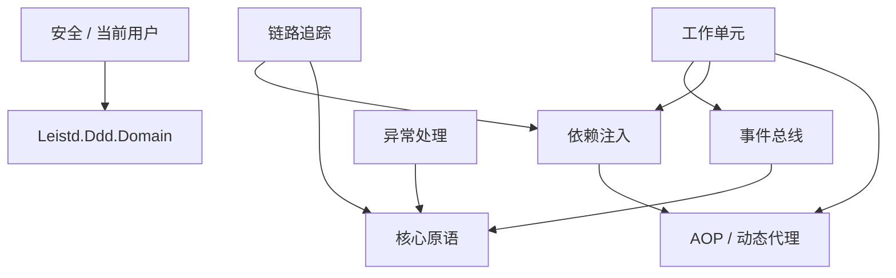

# Leistd 组件总览

本页汇总 Leistd 框架的全部组件分组，按一句话定位、包名与文档链接索引。点击「文档」列可查看各组件详细说明。

## 组件清单

| 分组 | 一句话定位 | 包 | 文档 |
| --- | --- | --- | --- |
| AOP / 动态代理 | 基于 Castle DynamicProxy 的异步拦截器基类，统一同步/异步方法的拦截入口并支持执行排序。 | `Leistd.DynamicProxy` | [`aop`](./aop.md) |
| 核心原语 | Leistd 框架的零依赖基础原语：时钟抽象（IClock/UtcClockProvider）与通用异常基类（CommonException），供其它组件复用。 | `Leistd.Core` | [`core`](./core.md) |
| 依赖注入 | 在 IServiceCollection 构建 IServiceProvider 时统一回调每个已注册服务，并据此动态织入拦截器（类似 ABP 的 OnRegistered）。 | `Leistd.DependencyInjection` | [`dependency-injection`](./dependency-injection.md) |
| 事件总线 | 进程内（本地）事件的发布/订阅抽象与实现：发布事件后由 DI 容器中注册的处理器同步消费。 | `Leistd.EventBus.Core`、`Leistd.EventBus.Local` | [`event-bus`](./event-bus.md) |
| 异常处理 | 语义化业务异常体系，并通过 ASP.NET Core 全局处理器统一转换为 RFC 7807 ProblemDetails 响应。 | `Leistd.Exception.Core`、`Leistd.Exception.AspNetCore` | [`exception`](./exception.md) |
| 分布式/本地锁 | 统一的加锁抽象 ILock，可在内存（单机）与 Redis（分布式）实现间按 DI 注册切换。 | `Leistd.Lock.Core`、`Leistd.Lock.Memory`、`Leistd.Lock.Redis` | [`lock`](./lock.md) |
| 对象映射 | 统一的对象映射抽象 IObjectMapper，可在 AutoMapper 与 Mapster 两种实现间切换。 | `Leistd.ObjectMapping.Core`、`Leistd.ObjectMapping.AutoMapper`、`Leistd.ObjectMapping.Mapster` | [`object-mapping`](./object-mapping.md) |
| 统一响应 | 为 ASP.NET Core 接口提供统一的 { code, message, data } 响应结构与自动包装。 | `Leistd.Response.Core`、`Leistd.Response.AspNetCore` | [`response`](./response.md) |
| 安全 / 当前用户 | 从认证主体（ClaimsPrincipal）读取当前用户、当前客户端信息，并支持在后台任务/测试中临时切换主体。 | `Leistd.Security.Core`、`Leistd.Security.AspNetCore` | [`security`](./security.md) |
| 链路追踪 | 基于 TraceId（CorrelationId）的全链路标识：AsyncLocal 进程内传递、自动注入日志 Scope，并在 ASP.NET Core 入站与 HttpClient 出站间透传。 | `Leistd.Tracing.Core`、`Leistd.Tracing.AspNetCore`、`Leistd.Tracing.HttpClient` | [`tracing`](./tracing.md) |
| 工作单元 | 借鉴 ABP 的 UnitOfWork 设计，通过 [UnitOfWork] 特性与 AOP 拦截器声明式管理数据库事务边界，并按提交阶段编排本地事件发布。 | `Leistd.UnitOfWork.Core`、`Leistd.UnitOfWork.EfCore` | [`unit-of-work`](./unit-of-work.md) |

## 依赖关系

下图依据各分组 `dependsOn` 勾勒组件间依赖（箭头由「依赖方」指向「被依赖方」，底层 `Leistd.Core` 在最下）。

无外部依赖的独立分组：`aop`（AOP / 动态代理）、`core`（核心原语）、`lock`（分布式/本地锁）、`object-mapping`（对象映射）、`response`（统一响应）。

> 注：`security` 依赖的 `Leistd.Ddd.Domain` 未在本总览的分组列表中，仅作为依赖标注。
