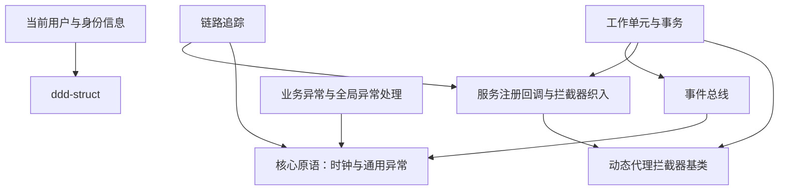

# Leistd 组件总览

本页是 Leistd 框架按功能分组的组件索引，汇总各分组的一句话定位、NuGet 包与文档链接。

## 组件清单

| 分组 | 一句话定位 | 包 | 文档 |
| --- | --- | --- | --- |
| 动态代理拦截器基类 | 基于 Castle DynamicProxy 的异步拦截器基类，统一同步/异步方法拦截入口并按 Order 排序织入 | `Leistd.DynamicProxy` | [`aop`](./aop.md) |
| 核心原语：时钟与通用异常 | Leistd 框架的零依赖基础原语：时钟抽象（IClock/UtcClockProvider）与通用异常基类（CommonException），供其它组件复用。 | `Leistd.Core` | [`core`](./core.md) |
| 服务注册回调与拦截器织入 | 类似 ABP OnRegistered 的服务注册回调机制，在构建 IServiceProvider 时按约定为已注册服务动态织入 AOP 拦截器。 | `Leistd.DependencyInjection` | [`dependency-injection`](./dependency-injection.md) |
| 事件总线 | 进程内发布/订阅事件总线，发布方与 IEventHandler 处理器解耦，由 DI 同步消费 | `Leistd.EventBus.Core`、`Leistd.EventBus.Local` | [`event-bus`](./event-bus.md) |
| 业务异常与全局异常处理 | 语义化业务异常体系 + ASP.NET Core 全局处理器，统一转换为 RFC 7807 ProblemDetails 响应 | `Leistd.Exception.Core`、`Leistd.Exception.AspNetCore` | [`exception`](./exception.md) |
| 分布式锁与本地锁 | 统一的加锁抽象 ILock，可在内存（单机）与 Redis（分布式）实现间按 DI 注册切换。 | `Leistd.Lock.Core`、`Leistd.Lock.Memory`、`Leistd.Lock.Redis` | [`lock`](./lock.md) |
| 对象映射 | 统一的 IObjectMapper 对象映射抽象，可在 AutoMapper 与 Mapster 两种实现间无缝切换。 | `Leistd.ObjectMapping.Core`、`Leistd.ObjectMapping.AutoMapper`、`Leistd.ObjectMapping.Mapster` | [`object-mapping`](./object-mapping.md) |
| 统一 API 响应 | 统一 {code, message, data} 响应模型与 ASP.NET Core 自动包装过滤器 | `Leistd.Response.Core`、`Leistd.Response.AspNetCore` | [`response`](./response.md) |
| 当前用户与身份信息 | 通过 ICurrentUser / ICurrentClient / ICurrentPrincipalAccessor 强类型读取当前登录用户与客户端身份，并支持临时切换主体。 | `Leistd.Security.Core`、`Leistd.Security.AspNetCore` | [`security`](./security.md) |
| 链路追踪 | 基于 TraceId（CorrelationId）的全链路标识：用 AsyncLocal 在异步上下文中传递，自动注入日志 Scope，并在 ASP.NET Core 入站与 HttpClient 出站之间透传。 | `Leistd.Tracing.Core`、`Leistd.Tracing.AspNetCore`、`Leistd.Tracing.HttpClient` | [`tracing`](./tracing.md) |
| 工作单元与事务 | 借鉴 ABP 的工作单元设计，用 [UnitOfWork] 特性与 AOP 拦截器声明式管理数据库事务边界，并按提交阶段编排领域事件发布。 | `Leistd.UnitOfWork.Core`、`Leistd.UnitOfWork.EfCore` | [`unit-of-work`](./unit-of-work.md) |

## 依赖关系

下图依据各分组 `dependsOn` 勾勒组件间依赖（箭头由「依赖方」指向「被依赖方」，底层 `Leistd.Core` 在最下）。

无外部 Leistd 依赖的独立分组：`aop`（动态代理）、`core`（核心原语）、`lock`（分布式锁与本地锁）、`object-mapping`（对象映射）、`response`（统一 API 响应）。

> 注：`security` 依赖的 `Leistd.Ddd.Domain` 属于 `ddd-struct`，未列入本组件总览，仅作依赖标注。
