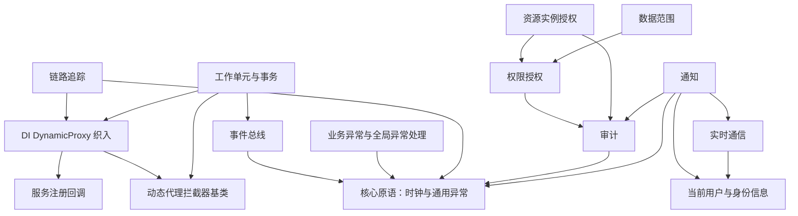

# Leistd 组件总览

本页是 Leistd 框架按功能分组的组件索引，汇总各分组的一句话定位、NuGet 包与文档链接。

## 组件清单

| 分组 | 一句话定位 | 包 | 文档 |
| --- | --- | --- | --- |
| 动态代理拦截器基类 | 基于 Castle DynamicProxy 的异步拦截器基类，统一同步/异步方法拦截入口并按 Order 排序织入 | `Leistd.DynamicProxy` | [`aop`](./aop.md) |
| 审计 | 通过标记接口声明实体的创建/修改/删除审计能力，EF Core 拦截器在保存时自动填充审计字段并把软删除转为逻辑删除 | `Leistd.Auditing.Core`、`Leistd.Auditing.EntityFrameworkCore` | [`auditing`](./auditing.md) |
| 权限授权 | 基于具名权限的细粒度授权：`IPermissionChecker` 统一检查入口，声明式定义权限并接入 ASP.NET Core 策略管道 | `Leistd.Authorization.Core`、`Leistd.Authorization.AspNetCore`、`Leistd.Authorization.EntityFrameworkCore` | [`authorization`](./authorization.md) |
| 资源实例授权 | 对**已加载的**单个资源实例裁决：领域规则 Handler 与资源 ACL 合并，拒绝优先、默认拒绝；并提供把 ACL 合并进集合查询的入口 | `Leistd.Authorization.Resource.Core`、`Leistd.Authorization.Resource.EntityFrameworkCore` | [`authorization-resource`](./authorization-resource.md) |
| 数据范围 | 把"能看到哪些候选数据"翻译成可由数据库执行的查询谓词，多个范围取并集；不内置组织模型 | `Leistd.Authorization.DataScope.Core` | [`authorization-data-scope`](./authorization-data-scope.md) |
| 核心原语：时钟与通用异常 | Leistd 框架的零依赖基础原语：时钟抽象（IClock/UtcClockProvider）与通用异常基类（CommonException），供其它组件复用。 | `Leistd.Core` | [`core`](./core.md) |
| 服务注册回调与拦截器织入 | DI 包提供服务注册回调；DynamicProxy 扩展包在此基础上按约定织入 AOP 拦截器。 | `Leistd.DependencyInjection`、`Leistd.DependencyInjection.DynamicProxy` | [`dependency-injection`](./dependency-injection.md) |
| 事件总线 | 进程内发布/订阅事件总线，发布方与 IEventHandler 处理器解耦，由 DI 同步消费 | `Leistd.EventBus.Core`、`Leistd.EventBus.Local` | [`event-bus`](./event-bus.md) |
| 业务异常与全局异常处理 | 语义化业务异常体系 + ASP.NET Core 全局处理器，统一转换为 RFC 7807 ProblemDetails 响应 | `Leistd.Exception.Core`、`Leistd.Exception.AspNetCore` | [`exception`](./exception.md) |
| 分布式锁与本地锁 | 统一的加锁抽象 ILock，可在内存（单机）与 Redis（分布式）实现间按 DI 注册切换。 | `Leistd.Lock.Core`、`Leistd.Lock.Memory`、`Leistd.Lock.Redis` | [`lock`](./lock.md) |
| 多语言本地化 | 基于嵌入 JSON 资源的 IStringLocalizer 实现：代码写文案键、文案随包分发按 culture 查表，未启用时自动退回直出原字符串 | `Leistd.Localization.Core`、`Leistd.Localization.AspNetCore` | [`localization`](./localization.md) |
| 通知 | 站内通知统一发布入口，可选持久化历史记录并通过 SignalR 实时推送给指定用户/分组/全体在线用户 | `Leistd.Notifications.Core`、`Leistd.Notifications.EntityFrameworkCore`、`Leistd.Notifications.AspNetCore.SignalR` | [`notifications`](./notifications.md) |
| 对象映射 | 统一的 IObjectMapper 对象映射抽象，可在 AutoMapper 与 Mapster 两种实现间无缝切换。 | `Leistd.ObjectMapping.Core`、`Leistd.ObjectMapping.AutoMapper`、`Leistd.ObjectMapping.Mapster` | [`object-mapping`](./object-mapping.md) |
| 实时通信 | 通用业务事件实时推送通道：按 resourceKey 订阅、在线状态跟踪与订阅授权扩展点，基于 SignalR 实现 | `Leistd.RealTime.Core`、`Leistd.RealTime.AspNetCore.SignalR` | [`realtime`](./realtime.md) |
| 统一 API 响应 | 统一 {code, message, data} 响应模型与 ASP.NET Core 自动包装过滤器 | `Leistd.Response.Core`、`Leistd.Response.AspNetCore` | [`response`](./response.md) |
| 当前用户与身份信息 | 通过 ICurrentUser / ICurrentClient / ICurrentPrincipalAccessor 强类型读取当前登录用户与客户端身份，并支持临时切换主体。 | `Leistd.Security.Core`、`Leistd.Security.AspNetCore` | [`security`](./security.md) |
| 链路追踪 | 基于 TraceId（CorrelationId）的全链路标识：用 AsyncLocal 在异步上下文中传递，自动注入日志 Scope，并在 ASP.NET Core 入站与 HttpClient 出站之间透传。 | `Leistd.Tracing.Core`、`Leistd.Tracing.AspNetCore`、`Leistd.Tracing.HttpClient` | [`tracing`](./tracing.md) |
| 工作单元与事务 | 用 [UnitOfWork] 特性与 AOP 拦截器声明式管理数据库事务边界，并按提交阶段编排领域事件发布。 | `Leistd.UnitOfWork.Core`、`Leistd.UnitOfWork.EfCore` | [`unit-of-work`](./unit-of-work.md) |

## 依赖关系

下图依据各分组 `dependsOn` 勾勒组件间依赖（箭头由「依赖方」指向「被依赖方」，底层 `Leistd.Core` 在最下）。

```mermaid
graph TD
    dependency-injection-dynamic-proxy[DI DynamicProxy 织入] --> dependency-injection[服务注册回调]
    dependency-injection-dynamic-proxy --> aop[动态代理拦截器基类]

    event-bus[事件总线] --> core[核心原语：时钟与通用异常]
    exception[业务异常与全局异常处理] --> core
    tracing[链路追踪] --> core
    tracing --> dependency-injection-dynamic-proxy

    unit-of-work[工作单元与事务] --> aop
    unit-of-work --> dependency-injection-dynamic-proxy
    unit-of-work --> event-bus

    auditing[审计] --> core
    authorization[权限授权] --> auditing
    authorizationResource[资源实例授权] --> authorization
    authorizationResource --> auditing
    authorizationDataScope[数据范围] --> authorization
    notifications[通知] --> core
    notifications --> auditing
    notifications --> security[当前用户与身份信息]
    notifications --> realtime[实时通信]
    realtime --> security
```

无外部 Leistd 依赖的独立分组：`aop`（动态代理）、`core`（核心原语）、`lock`（分布式锁与本地锁）、`localization`（多语言本地化，仅依赖 `Microsoft.Extensions.Localization.Abstractions`）、`object-mapping`（对象映射）、`response`（统一 API 响应）。注意 `auditing`/`authorization`/`realtime` 的 `.Core` 抽象包本身无 Leistd 组件依赖；图中的入边来自它们各自的 EF Core / SignalR 子包（如 `Leistd.Authorization.EntityFrameworkCore` 引用 `Leistd.Auditing.Core`）。

> 注：图中标注真实的 `ProjectReference` 依赖（含各家族的 EF Core / SignalR 子包边）。`notifications`/`realtime` 的实时推送实现另依赖 `Microsoft.AspNetCore.SignalR`（外部依赖，未单独列出）。组件与 `ddd-struct` **无正向编译期依赖**——实际方向相反：`Leistd.Ddd.Infrastructure` 引用 `Leistd.Auditing.EntityFrameworkCore`、`Leistd.Security.Core`。
