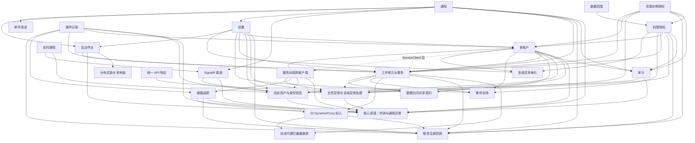

# Leistd 组件总览

本页是 Leistd 框架按功能分组的组件索引。当前 `framework/components/` 共有 **26 个能力分组、63 个 NuGet 包**；DDD 四层基座的 4 个包另见 [DDD 四层基座](../ddd-struct/ddd-struct.md)。

## 组件清单

| 分组 | 一句话定位 | 包 | 文档 |
| --- | --- | --- | --- |
| 动态代理拦截器基类 | 基于 Castle DynamicProxy 的异步拦截器基类，统一同步/异步方法拦截入口并按 Order 排序织入 | `Leistd.DynamicProxy` | [`aop`](./aop.md) |
| SignalR 基座 | 为每次 Hub 调用建立环境上下文（主体/租户/链路标识）并复评宿主授权策略；Hub 方法调用不经中间件，这些在其中本不成立 | `Leistd.AspNetCore.SignalR` | [`aspnetcore-signalr`](./aspnetcore-signalr.md) |
| 后台作业 | 周期任务按对齐 UTC 的时段执行，登记时显式选择全集群一份（锁 + 水位）或每副本一份；进程内队列把请求外的工作挪到后台并带上入队时的上下文 | `Leistd.BackgroundJobs.Core`、`Leistd.BackgroundJobs.InProcess`、`Leistd.BackgroundJobs.EntityFrameworkCore` | [`background-jobs`](./background-jobs.md) |
| 审计 | 通过标记接口声明实体的创建/修改/删除审计能力；创建审计在实体进入变更跟踪时落定，修改和删除审计在保存时处理 | `Leistd.Auditing.Core`、`Leistd.Auditing.EntityFrameworkCore` | [`auditing`](./auditing.md) |
| 权限授权 | 基于具名权限的细粒度授权：`IPermissionChecker` 统一检查入口，声明式定义权限并接入 ASP.NET Core 策略管道；自带权限管理端点与首次授予 | `Leistd.Authorization.Core`、`Leistd.Authorization.AspNetCore`、`Leistd.Authorization.EntityFrameworkCore` | [`authorization`](./authorization.md) |
| 资源实例授权 | 对**已加载的**单个资源实例裁决：领域规则 Handler 与资源 ACL 合并，拒绝优先、默认拒绝；并提供把 ACL 合并进集合查询的入口 | `Leistd.Authorization.Resource.Core`、`Leistd.Authorization.Resource.EntityFrameworkCore`、`Leistd.Authorization.Resource.AspNetCore` | [`authorization-resource`](./authorization-resource.md) |
| 数据范围 | 把"能看到哪些候选数据"翻译成可由数据库执行的查询谓词，多个范围取并集；不内置组织模型 | `Leistd.Authorization.DataScope.Core` | [`authorization-data-scope`](./authorization-data-scope.md) |
| 核心原语：时钟 | 提供时钟抽象（IClock/UtcClockProvider），供其他组件复用 | `Leistd.Core` | [`core`](./core.md) |
| 数据访问共享契约 | 零依赖叶子包：连接解析与归属（IConnectionStringResolver / [ConnectionStringName] / IConnectionAffinityProvider），以及存储、用例与端点共用的分页请求与结果（PageRequest / PagedResult） | `Leistd.Data` | [`data`](./data.md) |
| 服务注册回调与拦截器织入 | DI 包提供服务注册回调；DynamicProxy 扩展包在此基础上按约定织入 AOP 拦截器。 | `Leistd.DependencyInjection`、`Leistd.DependencyInjection.DynamicProxy` | [`dependency-injection`](./dependency-injection.md) |
| 邮件发送 | 统一的 IEmailSender 抽象与 SMTP 实现：发送失败一律抛异常，没有可用 SMTP 的环境显式注册空发送器，不含静默跳过发送的回落 | `Leistd.Email.Core`、`Leistd.Email.Smtp` | [`email`](./email.md) |
| 事件总线 | 进程内发布/订阅事件总线，发布方与 IEventHandler 处理器解耦，由 DI 同步消费 | `Leistd.EventBus.Core`、`Leistd.EventBus.Local` | [`event-bus`](./event-bus.md) |
| 业务异常与全局异常处理 | 语义化业务异常体系 + ASP.NET Core 全局处理器，统一转换为 RFC 9457 ProblemDetails 响应 | `Leistd.ExceptionHandling.Core`、`Leistd.ExceptionHandling.AspNetCore` | [`exception-handling`](./exception-handling.md) |
| 分布式锁与本地锁 | 统一的加锁抽象 ILock，可在内存（单机）与 Redis（分布式）实现间按 DI 注册切换。 | `Leistd.Lock.Core`、`Leistd.Lock.Memory`、`Leistd.Lock.Redis` | [`lock`](./lock.md) |
| 多语言本地化 | 基于嵌入 JSON 资源的 IStringLocalizer 实现：代码写文案键、文案随包分发按 culture 查表，未启用时自动退回直出原字符串 | `Leistd.Localization.Core`、`Leistd.Localization.AspNetCore` | [`localization`](./localization.md) |
| 多租户 | 租户环境上下文（AsyncLocal 可切换）、请求级解析与校验中间件、`IMultiTenant` 数据隔离标记与写入落值、租户注册表存储与管理原语；自带租户管理（创建开通与补偿）与连接登记端点，资源服务经远端存储回源控制面 | `Leistd.MultiTenancy.Core`、`Leistd.MultiTenancy.AspNetCore`、`Leistd.MultiTenancy.EntityFrameworkCore`、`Leistd.MultiTenancy.ServiceClient` | [`multi-tenancy`](./multi-tenancy.md) |
| 通知 | 站内通知统一发布入口：先写入用户历史，再通过 SignalR 推送给该用户；自带通知中心端点、保留期清理，以及按用户设置过滤与邮件渠道两个桥接包 | `Leistd.Notifications.Core`、`Leistd.Notifications.EntityFrameworkCore`、`Leistd.Notifications.AspNetCore.SignalR`、`Leistd.Notifications.AspNetCore`、`Leistd.Notifications.Settings`、`Leistd.Notifications.Email` | [`notifications`](./notifications.md) |
| 对象映射 | 统一的 IObjectMapper 对象映射抽象，实现为 Mapster。 | `Leistd.ObjectMapping.Core`、`Leistd.ObjectMapping.Mapster` | [`object-mapping`](./object-mapping.md) |
| 操作记录 | 关键操作的审计留痕：什么人在什么时间做了什么、结果如何；业务显式调用，授权阶段的拒绝按注解补记 | `Leistd.OperationRecords.Core`、`Leistd.OperationRecords.EntityFrameworkCore`、`Leistd.OperationRecords.AspNetCore` | [`operation-records`](./operation-records.md) |
| 实时通信 | 通用业务事件实时推送通道：按 resourceKey 订阅与订阅授权扩展点，基于 SignalR 实现 | `Leistd.RealTime.Core`、`Leistd.RealTime.AspNetCore.SignalR` | [`realtime`](./realtime.md) |
| 统一 API 响应 | 统一 {code, message, data} 响应模型与 ASP.NET Core 自动包装过滤器 | `Leistd.Response.Core`、`Leistd.Response.AspNetCore` | [`response`](./response.md) |
| 设置 | 运行期可改的设置：业务声明定义与值域，框架按 用户 → 租户 → 代码默认值 回落解析并持久化；自带设置页端点，宿主级设置可经配置源覆盖部署配置 | `Leistd.Settings.Core`、`Leistd.Settings.EntityFrameworkCore`、`Leistd.Settings.AspNetCore`、`Leistd.Settings.Hosting` | [`settings`](./settings.md) |
| 服务间调用客户端 | 服务互调标准管道：Refit 接口式/手写强类型客户端注册、调用日志、TraceId 与用户上下文透传、client credentials 认证（缓存/401 自愈）、统一响应解包与远端错误还原、被调方受信恢复用户主体 | `Leistd.ServiceClient.Core`、`Leistd.ServiceClient.Refit`、`Leistd.ServiceClient.OAuth`、`Leistd.ServiceClient.AspNetCore` | [`service-client`](./service-client.md) |
| 当前用户与身份信息 | 通过 ICurrentUser / ICurrentClient / ICurrentPrincipalAccessor 强类型读取当前登录用户与客户端身份，并支持临时切换主体。 | `Leistd.Security.Core`、`Leistd.Security.AspNetCore` | [`security`](./security.md) |
| 链路追踪 | 全链路标识以 `System.Diagnostics.Activity` 的 TraceId 为准（无 Activity 时生成 W3C 形态标识），自动注入日志 Scope，并在 ASP.NET Core 入站与 HttpClient 出站之间透传。 | `Leistd.Tracing.Core`、`Leistd.Tracing.AspNetCore`、`Leistd.Tracing.HttpClient` | [`tracing`](./tracing.md) |
| 工作单元与事务 | 用 [UnitOfWork] 特性与 AOP 拦截器声明式管理数据库事务边界，并按提交阶段编排领域事件发布。 | `Leistd.UnitOfWork.Core`、`Leistd.UnitOfWork.EntityFrameworkCore` | [`unit-of-work`](./unit-of-work.md) |

## 定制组件行为

带端点的组件（设置、权限、多租户、操作记录、通知）按"契约与用例 / 存储 / `Map*` 端点"分包。需要偏离默认行为时，从上往下选第一个够用的层级：

| 层级 | 做法 | 适用 |
| --- | --- | --- |
| 配置 | 组件选项与配置节 | 策略名、保留天数、调度时间、作业开关 |
| 端点约定 | 在 `Map*` 返回的路由组或外层 `MapGroup` 上加约定；按组件公开的 `NamePrefix` 常量对单个端点追加元数据 | 路由前缀、限流、OpenAPI 标签、`WithResultWrapper()`、两步验证放行 |
| 钩子 | 实现组件声明的窄接口 | 主体目录、租户开通与启用前置、设置值校验、通知收件人解析 |
| 替换服务 | 组件用 `TryAdd` 注册，先于组件注册或 `Replace` 即可替换 | 换存储实现、装饰查询用例（只能收窄可见范围） |
| 自写端点 | 不调 `Map*`，在 Core 的用例服务上写自己的端点 | 路由形状或 DTO 与组件不同、聚合接口、换导出格式 |

组件状态变化（设置写入、授权替换、租户增删改）以本地事件发出，宿主订阅即可留痕或联动，不需要包装组件服务。

## 依赖关系

下图按各分组 csproj 的**直接** `ProjectReference` 勾勒组件间依赖（箭头由「依赖方」指向「被依赖方」，底层 `Leistd.Core` 在最下）。传递依赖不画。

`aop`、`core`、`data`、`event-bus`、`localization`、`lock`、`object-mapping` **没有任何跨分组依赖**（家族内只有 `*.Core` ← 实现包），因此图中只作为被依赖方出现或不出现——不是漏画。

```mermaid
graph TD
    dependency-injection-dynamic-proxy[DI DynamicProxy 织入] --> dependency-injection[服务注册回调]
    dependency-injection-dynamic-proxy --> aop[动态代理拦截器基类]

    exception[业务异常与全局异常处理] --> core[核心原语：时钟与通用异常]
    tracing[链路追踪] --> core
    tracing --> dependency-injection
    tracing --> dependency-injection-dynamic-proxy

    unit-of-work[工作单元与事务] --> aop
    unit-of-work --> dependency-injection
    unit-of-work --> dependency-injection-dynamic-proxy
    unit-of-work --> event-bus[事件总线]
    unit-of-work --> exception
    unit-of-work --> data[数据访问共享契约]

    security[当前用户与身份信息] --> core
    auditing[审计] --> core
    auditing --> security
    multiTenancy[多租户] --> core
    multiTenancy --> exception
    multiTenancy --> auditing
    multiTenancy --> security
    multiTenancy --> unit-of-work
    multiTenancy --> data
    multiTenancy --> event-bus
    multiTenancy --> localization
    multiTenancy -.->|ServiceClient 包| serviceClient
    authorization[权限授权] --> auditing
    authorization --> dependency-injection
    authorization --> exception
    authorization --> multiTenancy
    authorization --> unit-of-work
    authorization --> event-bus
    authorization --> localization
    authorizationResource[资源实例授权] --> authorization
    authorizationResource --> auditing
    authorizationResource --> dependency-injection
    authorizationResource --> exception
    authorizationResource --> multiTenancy
    authorizationResource --> unit-of-work
    authorizationDataScope[数据范围] --> authorization
    settings[设置] --> dependency-injection
    settings --> exception
    settings --> security
    settings --> multiTenancy
    settings --> unit-of-work
    settings --> event-bus
    settings --> localization[多语言本地化]
    settings --> backgroundJobs
    operationRecords[操作记录] --> core
    operationRecords --> security
    operationRecords --> multiTenancy
    operationRecords --> unit-of-work
    operationRecords --> tracing
    operationRecords --> dependency-injection
    notifications[通知] --> core
    notifications --> auditing
    notifications --> dependency-injection
    notifications --> unit-of-work
    notifications --> signalr[SignalR 基座]
    notifications --> settings
    notifications --> email[邮件发送]
    notifications --> backgroundJobs
    realtime[实时通信] --> security
    realtime --> signalr
    signalr --> core
    signalr --> security
    response[统一 API 响应] --> exception

    serviceClient[服务间调用客户端] --> core
    serviceClient --> security
    serviceClient --> tracing
    serviceClient --> exception
    serviceClient --> multiTenancy
    backgroundJobs[后台作业] --> lock[分布式锁与本地锁]
    backgroundJobs --> core
    backgroundJobs --> unit-of-work
```

`Leistd.Core` 还承载跨维度的环境上下文原语；主体实现在 `Leistd.Security.Core`，租户与链路贡献者分别由 `Leistd.MultiTenancy.AspNetCore` 和 `Leistd.Tracing.Core` 登记。

无跨分组 Leistd 依赖的独立分组：`aop`（动态代理）、`core`（核心原语）、`data`（连接解析与分页契约）、`email`（邮件发送）、`event-bus`（事件总线）、`lock`（分布式锁与本地锁）、`localization`（多语言本地化，仅依赖 `Microsoft.Extensions.Localization.Abstractions`）、`object-mapping`（对象映射）。`response` 依赖 `exception-handling`，图中已画。注意 `auditing`/`authorization`/`realtime` 的 `.Core` 抽象包本身无 Leistd 组件依赖；图中的入边来自它们各自的 EF Core / SignalR / AspNetCore 子包（如 `Leistd.Authorization.EntityFrameworkCore` 引用 `Leistd.Auditing.Core`，`Leistd.MultiTenancy.AspNetCore` 引用 `Leistd.Security.Core`；`multi-tenancy → auditing` 一边来自 `Leistd.MultiTenancy.EntityFrameworkCore` 的租户注册表审计接口）。`Leistd.Authorization.Core` 引用 `Leistd.MultiTenancy.Core` 承载权限定义的多租户侧别。

图中只画 Leistd 包的直接 `ProjectReference`；外部 SignalR 依赖不单列。组件不依赖 `ddd-struct`，实际方向是 `Leistd.Ddd.Infrastructure` 引用组件包。
