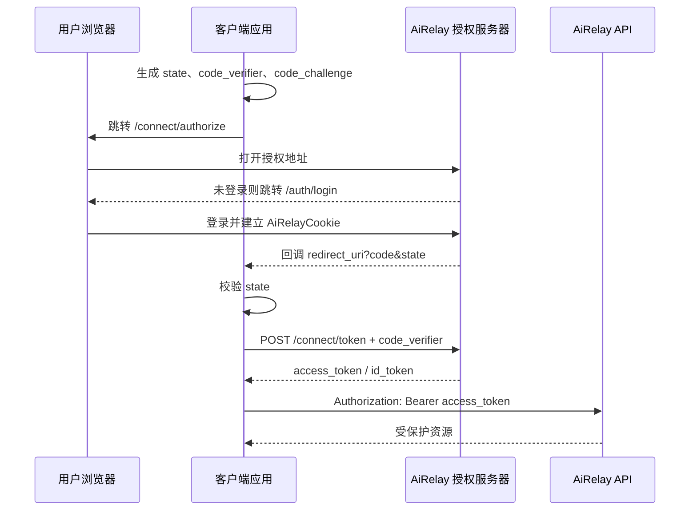

# OAuth2/OIDC 客户端接入说明

## 简介

AiRelay 基于 OpenIddict 提供 OAuth2/OpenID Connect 授权服务器能力。客户端可以通过标准 Authorization Code + PKCE 接入 AiRelay 登录体系，并使用 AiRelay 签发的 Access Token 调用受保护 API。

服务根地址示例：

```text
https://your-ai-relay.example.com
```

客户端应优先通过 Discovery 获取端点信息：

```http
GET /.well-known/openid-configuration
```

常用端点：

| 端点 | 用途 |
|---|---|
| `/connect/authorize` | 授权登录 |
| `/connect/token` | code / refresh token 换 token |
| `/connect/userinfo` | 获取用户信息 |
| `/connect/logout` | 标准登出 |

## 授权标准与应用场景

### 标准流程

当前推荐并支持的标准流程是：

```text
Authorization Code + PKCE
```

适用场景：

- Web 前端项目。
- 桌面客户端。
- 移动端客户端。
- CLI 或本地工具。
- 需要代表用户访问 AiRelay API 的第三方应用。

不支持的旧流程：

- password grant。
- implicit flow。
- 自定义 token grant，例如 `register`、`external_login`。

### 内置 Web 客户端

AiRelay 自有 Web 前端使用内置客户端：

```text
client_id: ai-relay-web
client_type: public
require_pkce: true
```

默认 scope：

```text
openid profile email roles
```

`ai-relay-web` 不授予 refresh token，不请求 `offline_access`。

### Refresh Token 使用原则

服务端保留 refresh token 能力，但不提供给内置 Web SPA。

如桌面、CLI、移动端或服务端集成需要长会话，应单独注册客户端，并按客户端类型决定是否授予：

```text
offline_access
```

Refresh token 必须安全存储，并在退出登录或账号解绑时清除。

## 接入指引



### 1. 准备客户端信息

需要从 AiRelay 获取：

```text
client_id
redirect_uri
post_logout_redirect_uri
scope
```

前端 Web 项目通常配置：

```text
client_id=ai-relay-web
redirect_uri=https://your-app.example.com/auth/callback
post_logout_redirect_uri=https://your-app.example.com/auth/login
scope=openid profile email roles
```

生产环境 redirect URI 必须与服务端登记值精确匹配，不允许通配符。

### 2. 发起授权请求

客户端生成：

- `state`：随机值，回调时校验。
- `code_verifier`：高熵随机字符串。
- `code_challenge`：`BASE64URL(SHA256(code_verifier))`。
- `code_challenge_method`：固定 `S256`。

跳转到 AiRelay 授权端点：

```http
GET /connect/authorize?response_type=code&client_id=ai-relay-web&redirect_uri=https%3A%2F%2Fyour-app.example.com%2Fauth%2Fcallback&scope=openid%20profile%20email%20roles&state=random-state&code_challenge=your-code-challenge&code_challenge_method=S256
```

用户未登录时，AiRelay 会跳转到登录页；登录完成后继续授权流程。

### 3. 处理回调

授权成功后，AiRelay 会跳回客户端：

```text
https://your-app.example.com/auth/callback?code=authorization-code&state=random-state
```

客户端必须校验 `state` 与发起授权时保存的值一致。

### 4. 换取 Access Token

```http
POST /connect/token
Content-Type: application/x-www-form-urlencoded

client_id=ai-relay-web&grant_type=authorization_code&code=authorization-code&redirect_uri=https%3A%2F%2Fyour-app.example.com%2Fauth%2Fcallback&code_verifier=your-code-verifier
```

公开客户端不需要 `client_secret`。

响应示例：

```json
{
  "access_token": "...",
  "token_type": "Bearer",
  "expires_in": 3600,
  "id_token": "..."
}
```

字段说明：

| 字段 | 说明 |
|---|---|
| `access_token` | 调用 AiRelay API 使用的 Bearer Token |
| `token_type` | 通常为 `Bearer` |
| `expires_in` | access token 有效期，单位秒 |
| `id_token` | OIDC 身份 token，客户端通常不需要解析它来调用 API |
| `refresh_token` | 仅当客户端被授予 `offline_access` 时可能返回 |

当前内置 `ai-relay-web` 不会返回 `refresh_token`。

### 5. 调用 API

业务 API 使用 Bearer Token 访问。以当前用户接口为例：

```http
GET /api/v1/auth/me
Authorization: Bearer <access_token>
```

响应示例：

```json
{
  "id": "018f0000-0000-0000-0000-000000000001",
  "username": "admin",
  "email": "admin@example.com",
  "nickname": "系统管理员",
  "avatar": "https://example.com/avatar.png",
  "isActive": true,
  "creationTime": "2026-05-07T10:00:00Z",
  "roles": ["Admin"]
}
```

字段说明：

| 字段 | 说明 |
|---|---|
| `id` | AiRelay 用户 ID |
| `username` | 用户名 |
| `email` | 邮箱 |
| `nickname` | 昵称，可为空 |
| `avatar` | 头像地址，可为空 |
| `phoneNumber` | 手机号，可为空；为空时可能不返回 |
| `isActive` | 用户是否启用 |
| `creationTime` | 用户创建时间 |
| `roles` | 用户角色列表 |

如果只需要标准 OIDC 用户信息，调用 UserInfo Endpoint：

```http
GET /connect/userinfo
Authorization: Bearer <access_token>
```

响应示例：

```json
{
  "sub": "018f0000-0000-0000-0000-000000000001",
  "name": "系统管理员",
  "preferred_username": "admin",
  "picture": "https://example.com/avatar.png",
  "email": "admin@example.com",
  "email_verified": true,
  "role": ["Admin"]
}
```

UserInfo 返回字段取决于授权 scope：

| Scope | 用户信息 |
|---|---|
| `openid` | `sub` |
| `profile` | `name`、`preferred_username`、`picture` |
| `email` | `email`、`email_verified` |
| `roles` | `role` |

### 6. 登出

客户端应先清理本地 token，再跳转 AiRelay 标准登出端点：

```http
GET /connect/logout?client_id=ai-relay-web&post_logout_redirect_uri=https%3A%2F%2Fyour-app.example.com%2Fauth%2Flogin
```

`post_logout_redirect_uri` 必须与服务端登记值精确匹配。登出成功后，AiRelay 会清理授权服务器 Cookie，并重定向到该地址，不返回 JSON 响应体。

## 接入注意事项

- 生产环境必须使用 HTTPS。
- 必须使用 PKCE，且 `code_challenge_method=S256`。
- 必须校验 `state`。
- 不要把 token 写入 URL、日志或错误上报。
- Web SPA 不建议长期保存 refresh token。
- 不要依赖 access token 内部结构；需要用户信息时调用 `/connect/userinfo`。
- 每个真实客户端应使用独立 `client_id`，不要复用 `ai-relay-web` 作为第三方生产客户端。
